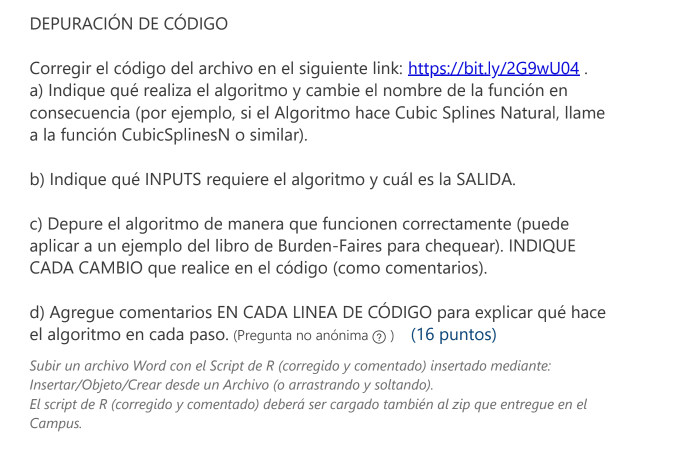

```{r setup, include=FALSE}
knitr::opts_chunk$set(echo = TRUE)
```



Link: https://bit.ly/2G9wU04


## Código a corregir
```{r}
# Algoritmo <- function(f,a,b,N,alfa){
#   h <- (b-a)/n
#   t <- matrix(seq(a;b;h), nrow= n+1, ncol=1)
#   w <- matrix(NA, nrow = N+1, ncol=1)
#   w[0] = Alfa
#   for(i in (1:N)){
#     w[i+1]<- w[i]+h*f(t[j],w[j])
#   }
#   return(data.frame(t,w))
# }
```

## Corregido
```{r}
Euler <- function(f,a,b,N,alfa){ #Es el método de Euler para ecuaciones diferenciales
  h <- (b-a)/N #Cambio n por N
  t <- matrix(seq(a,b,h), nrow= N+1, ncol=1) #Cambio los ; por . #Cambio n por N
  w <- matrix(NA, nrow = N+1, ncol=1)
  w[1] = alfa #Cambio 0 por 1. #Cambio Alfa por alfa
  for(i in (1:N)){
    w[i+1]<- w[i]+h*f(t[i],w[i]) #Cambio j por i
  }
  return(w) #Cambio para que me devuelva la matriz
}
```

Testeo el método
```{r}
Euler(a = 0, b = 2, N = 4, alfa = 0.5, f = function(t, w){return(w - t^2 + 1)})
```

