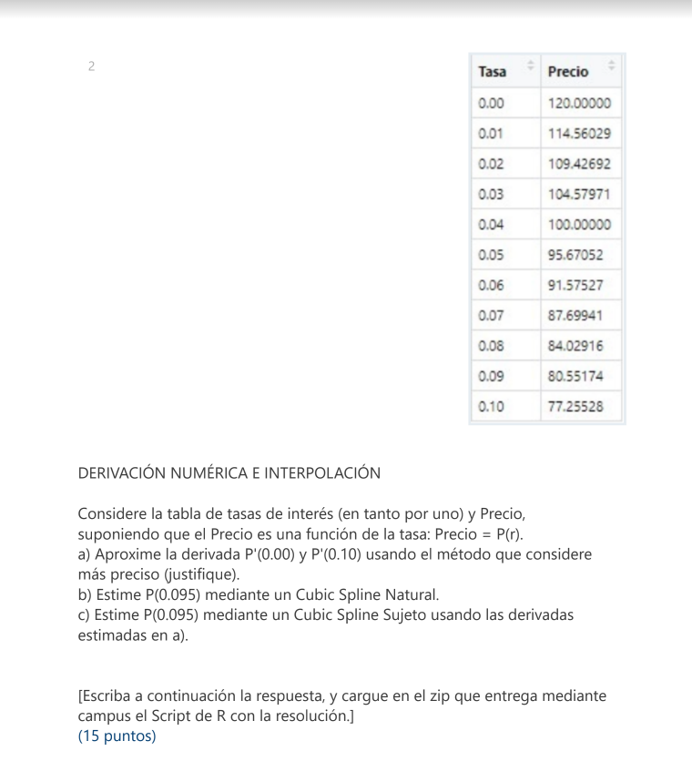

```{r}
DerivadaPorDefinicion <- function(x, fx){
  fprima <- rep(NA, times = length(x))
  
  #Se asume que todos los valores estan separados por un h constante
  h <- x[2] - x[1]
  
  #Diferencia progresiva
  for (i in 1:(length(x)-1)){
    fprima[i] <- (fx[i+1] - fx[i]) / h
  }
  
  #Diferencia regresiva
  for (i in (length(x):2)) {
    fprimaReg <- (fx[i-1] - fx[i]) / (-h)
    
    if (!is.na(fprima[i])){
      if(fprimaReg != fprima[i]){
        aux <- fprima[i]
        fprima[i] <- glue::glue(aux, " (P)",
                                " o ",
                                fprimaReg, " (R)" )
      }  
    } else{
      fprima[i] <- fprimaReg
    }
    
  }
  
  resultado <- data.frame(x, fx, fprima)
  
  return(resultado)
}
```

```{r}
SplineNatural <- function(x, y){
 #browser()
  n <- length(x)
  
  # Paso 1
  h <- rep(NA, times = (n-1))
  for (i in 1:(n-1)) {
    h[i] <- x[i+1] - x[i]
  }; rm(i)
  
  # Paso 2
  alfa <- rep(NA, times = (n-2))
  for (i in 2:(n-1)) {
    alfa[i] <- (3/h[i]) * (y[i+1] - y[i]) - (3/h[i-1]) * (y[i] - y[i-1])
  }
  
  # Paso 3
  mu <- rep(NA, times = n)
  zeta <- rep(NA, times = n)
  l <- rep(NA, times = n)
  
  mu[1] <- 0
  zeta[1] <- 0
  l[1] <- 1
  
  
  # Paso 4
  for (i in 2:(n-1)) {
    l[i] <- 2 * (x[i+1] - x[i-1]) - h[i-1] * mu[i-1]
    mu[i] <- h[i]/l[i]
    zeta[i] <- (alfa[i] - h[i-1] * zeta[i-1])/l[i]
  }
  
  # Paso 5
  l[n] <- 1
  zeta[n] <- 0
  c <- rep(NA, times = n)
  c[n] <- 0
  
  # Paso 6
  b <- rep(NA, times = (n-1))
  d <- rep(NA, times = (n-1))
  for (j in (n-1):1) {
    c[j] <- zeta[j] - mu[j] * c[j+1]
    b[j] <- (y[j+1] - y[j]) / h[j] - h[j] * (c[j+1] + 2 * c[j])/3
    d[j] <- (c[j+1] - c[j]) / (3*h[j])
  }
  
  #Paso 7
  resultados <- matrix(rep(NA, 4*(n-1)), nrow = (n-1), ncol = 4, byrow = F)
  for (k in 1:(n-1)) {
    resultados[k, 1] <- y[k]
    resultados[k, 2] <- b[k]
    resultados[k, 3] <- c[k]
    resultados[k, 4] <- d[k]
  }
  
  print(resultados)
  
  #Construyo el polinomio
  polinomios <- rep(NA, times = nrow(resultados))
  for (i in 1:nrow(resultados)) {
    polinomios[i] <- glue::glue(resultados[i,1]) 
    for(j in 2:ncol(resultados)){
      polinomios[i] <- polinomios[i] + glue::glue(" + ", resultados[i,j], " * (x - ", x[i], ")^", (j-1)) 
    }
  }
  
  return(polinomios)
}
```

```{r}
SplineCondicionado <- function(x, y, fpo, fpn){
  #browser()
  n <- length(x)
  
  # Paso 1
  h <- rep(NA, times = (n-1))
  for (i in 1:(n-1)) {
    h[i] <- x[i+1] - x[i]
  }; rm(i)
  
  # Paso 2
  alfa <- rep(NA, times = n)
  alfa[1] <- 3 * (y[2] - y[1])/h[1] - 3 * fpo
  alfa[n] <- 3 * fpn - 3 * (y[n] - y[n-1]) / h[n-1]
  
  # Paso 3
  for (i in 2:(n-1)) {
    alfa[i] <- (3/h[i]) * (y[i+1] - y[i]) - (3/h[i-1]) * (y[i] - y[i-1])
  }; rm(i)
  
  # Paso 4
  mu <- rep(NA, times = n)
  zeta <- rep(NA, times = n)
  l <- rep(NA, times = n)
  
  l[1] <- 2 * h[1]
  mu[1] <- 0.5
  zeta[1] <- alfa[1]/l[1]
  
  
  
  # Paso 5
  for (i in 2:(n-1)) {
    l[i] <- 2 * (x[i+1] - x[i-1]) - h[i-1] * mu[i-1]
    mu[i] <- h[i]/l[i]
    zeta[i] <- (alfa[i] - h[i-1] * zeta[i-1])/l[i]
  }
  
  # Paso 6
  l[n] <- h[n-1] * (2 - mu[n-1])
  zeta[n] <- (alfa[n] - h[n-1] * zeta[n-1]) / l[n]
  c <- rep(NA, times = n)
  c[n] <- zeta[n]
  
  # Paso 7
  b <- rep(NA, times = (n-1))
  d <- rep(NA, times = (n-1))
  for (j in (n-1):1) {
    c[j] <- zeta[j] - mu[j] * c[j+1]
    b[j] <- (y[j+1] - y[j]) / h[j] - h[j] * (c[j+1] + 2 * c[j])/3
    d[j] <- (c[j+1] - c[j]) / (3*h[j])
  }
  
  #Paso 7
  resultados <- matrix(rep(NA, 4*(n-1)), nrow = (n-1), ncol = 4, byrow = F)
  for (k in 1:(n-1)) {
    resultados[k, 1] <- y[k]
    resultados[k, 2] <- b[k]
    resultados[k, 3] <- c[k]
    resultados[k, 4] <- d[k]
  }
  
  print(resultados)
  
  #Construyo el polinomio
  polinomios <- rep(NA, times = nrow(resultados))
  for (i in 1:nrow(resultados)) {
    polinomios[i] <- glue::glue(resultados[i,1]) 
    for(j in 2:ncol(resultados)){
      polinomios[i] <- polinomios[i] + glue::glue(" + ", resultados[i,j], " * (x - ", x[i], ")^", (j-1)) 
    }
  }
  
  return(polinomios)
}
```


```{r setup, include=FALSE}
knitr::opts_chunk$set(echo = TRUE)
```
## Métodos




```{r}
# Cargo el df
df <- data.frame("Tasa" = seq(from = 0, to = 0.1, by = 0.01), "Precio" = c(120, 114.56029, 109.42692, 104.57971, 100, 95.67052, 91.57527, 87.69941, 84.02916, 80.55174, 77.25528))
```

## A
Vuelvo a la definición de derivada:
\begin{equation*}
  \displaystyle \lim_{x \to \infty} f'(x) = \dfrac{f(x+h)-f(x)}{h}
\end{equation*}
```{r}
print(paste("P'(0):",(120 - 114.56029)/0.1))

print(paste("P'(0.1):",(77.25528 - 80.55174)/0.1))

DerivadaPorDefinicion(x = df$Tasa, fx = df$Precio)
```

## B
```{r}
trazadores <- SplineNatural(x = df$Tasa, y = df$Precio)

eval(parse(text = trazadores[10]), list(x = 0.095))

```

## C
```{r}
trazadores_condicionados <- SplineCondicionado(x = df$Tasa, y = df$Precio, fpo = (120 - 114.56029)/0.1, fpn = (77.25528 - 80.55174)/0.1)

eval(parse(text = trazadores_condicionados[10]), list(x = 0.095))
```

