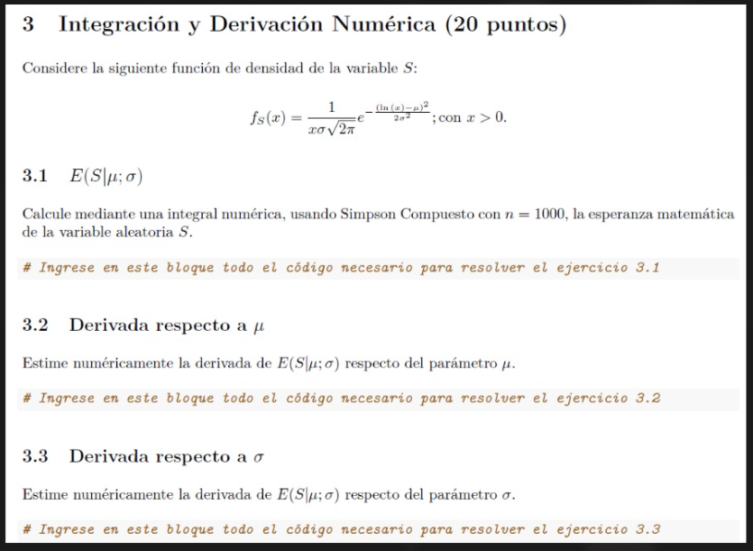

```{r setup, include=FALSE}
knitr::opts_chunk$set(echo = TRUE)
library(ggplot2)
```




## Métodos
```{r}
IntegracionCompuesta <- function(limiteInferior, limiteSuperior, funcion, n, cantIntervalos){
  
  #browser()
  if ((n == 2 || n == 0) && cantIntervalos%%2 != 0){
    return("cantIntervalos debe ser un entero par")
  }
  
  cantIntervalos <- cantIntervalos/n
  
  
  crecimientoIntervalo <- (limiteSuperior-limiteInferior)/cantIntervalos
  
  fx <- rep(NA, times = (n+1))
  
  resultado <- 0
  
  for (i in 1:cantIntervalos) {
    limiteSuperior <- limiteInferior + crecimientoIntervalo
    
    if (n != 0){
      h <- (limiteSuperior - limiteInferior)/n
    }
    
    
    for (i in 1:(n+1)) {
      fx[i] <- eval(funcion, list(x = limiteInferior + (i-1)*h))
    }
    
    if(n == 2){
      resultado <- resultado + (h/3) * (fx[1] + 4*fx[2] + fx[3])
    }
    
    limiteInferior <- limiteSuperior
  }
  
  return(resultado)
}
```

```{r}
CompuestaSimpson <- function(limINF, limSUP, funcion, n){
  h <- (limSUP - limINF)/n
  fx0 <- eval(funcion, list(x = limINF)) #(f(a))
  fxn <- eval(funcion, list(x = limSUP)) #(f(b))
  
  suma1 <- 0 # la de X_2j
  suma2 <- 0 # la de X_2j-1
  
  for (j in 1:(n-1)) {
    xj <- limINF + j*h
    if ((j %% 2) == 0){
      suma1 <- suma1 + eval(funcion, list(x = xj))
    } else {
      suma2 <- suma2 + eval(funcion, list(x = xj))
    }
  } 
  
  intCompuestaS <- h * (fx0 + 2 * suma1 + 4 * suma2 + fxn)/3
  return(intCompuestaS)
  
# n debe ser par si o si
}
```


\newpage

## Ejercicio 3.1
```{r}
mu <- 3.65
sigma <- 0.18

x1 <- seq(from = 0.0001, to = 100, by = 0.1)
fx <- eval(expression( ((1)/(x*sigma*sqrt(2*pi))) * exp(- (log(x)-mu)^2/(2*sigma^2)) ), list(x = x1))

ggplot() +
  geom_line(aes(x = x1, y = fx))

tetas <- IntegracionCompuesta(limiteInferior = 0.0001, limiteSuperior = 1000, funcion = expression(x * ((1)/(x*sigma*sqrt(2*pi))) * exp(- (log(x)-mu)^2/(2*sigma^2)) ), n = 2, cantIntervalos = 1000) 

culo <- CompuestaSimpson(limINF = 0.0001, limSUP = 1000, funcion = expression(x * ((1)/(x*sigma*sqrt(2*pi))) * exp(- (log(x)-mu)^2/(2*sigma^2)) ), n = 1000)
```

\newpage

## Ejercicio 3.2
Vuelvo a la definición clásica de derivada:
\begin{equation*}
  \displaystyle \lim_{x \to \infty} f'(x) = \dfrac{f(x+h)-f(x)}{h}
\end{equation*}

```{r}
fx <- IntegracionCompuesta(limiteInferior = 1, limiteSuperior = 100, funcion = expression(x * ((1)/(x*sigma*sqrt(2*pi))) * exp(- (log(x)-mu)^2/(2*sigma^2)) ), n = 2, cantIntervalos = 1000) 

mu <- 3.65 + 10^-10

fx_h <- IntegracionCompuesta(limiteInferior = 1, limiteSuperior = 100, funcion = expression(x * ((1)/(x*sigma*sqrt(2*pi))) * exp(- (log(x)-mu)^2/(2*sigma^2)) ), n = 2, cantIntervalos = 1000)

(fx_h - fx) / (10^-10)
```

## Ejercicio 3.3
Vuelvo a la definición clásica de derivada:
\begin{equation*}
  \displaystyle \lim_{x \to \infty} f'(x) = \dfrac{f(x+h)-f(x)}{h}
\end{equation*}

```{r}
fx <- IntegracionCompuesta(limiteInferior = 1, limiteSuperior = 100, funcion = expression(x * ((1)/(x*sigma*sqrt(2*pi))) * exp(- (log(x)-mu)^2/(2*sigma^2)) ), n = 2, cantIntervalos = 1000) 

sigma <- 0.18 + 10^-10

fx_h <- IntegracionCompuesta(limiteInferior = 1, limiteSuperior = 100, funcion = expression(x * ((1)/(x*sigma*sqrt(2*pi))) * exp(- (log(x)-mu)^2/(2*sigma^2)) ), n = 2, cantIntervalos = 1000)

(fx_h - fx) / (10^-10)
```
