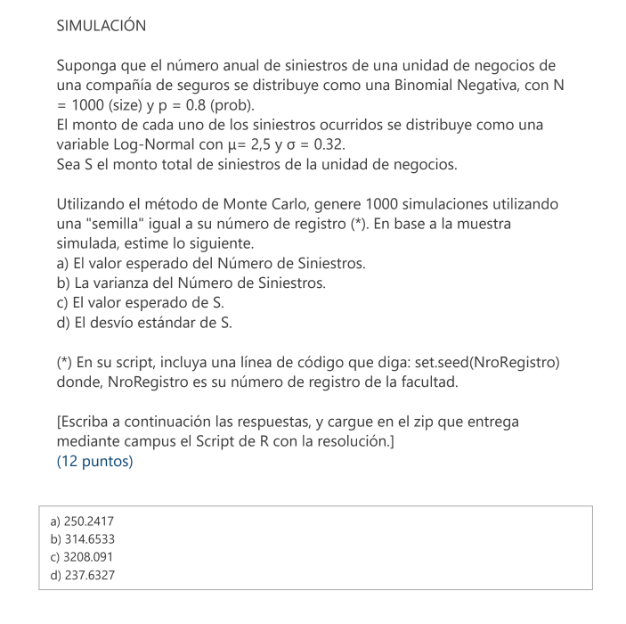

```{r setup, include=FALSE}
knitr::opts_chunk$set(echo = TRUE)
```




\newpage

```{r}
N <- 1000
resultado <- matrix(NA, nrow = N, ncol = 2)
set.seed(895700)

for (i in 1:N) {
  # Genera un número aleatorio con distribucion binomial
  n <- rnbinom(n = 1, size = 1000, prob = 0.8)

  resultado[i, 1] <- n

  xi <- rlnorm(n = n, meanlog = 2.5, sdlog = 0.32)

  suma <- sum(xi)

  resultado[i,2] <- suma
}

n_esperanza <- mean(resultado[,1])
n_varianza <- var(resultado[,1])

suma_esperanza <- mean(resultado[,2])
suma_varianza <- var(resultado[,2])
```

### a
```{r}
n_esperanza
```

### b
```{r}
n_varianza
```

### c
```{r}
suma_esperanza
```

### d
```{r}
sqrt(suma_varianza)
```