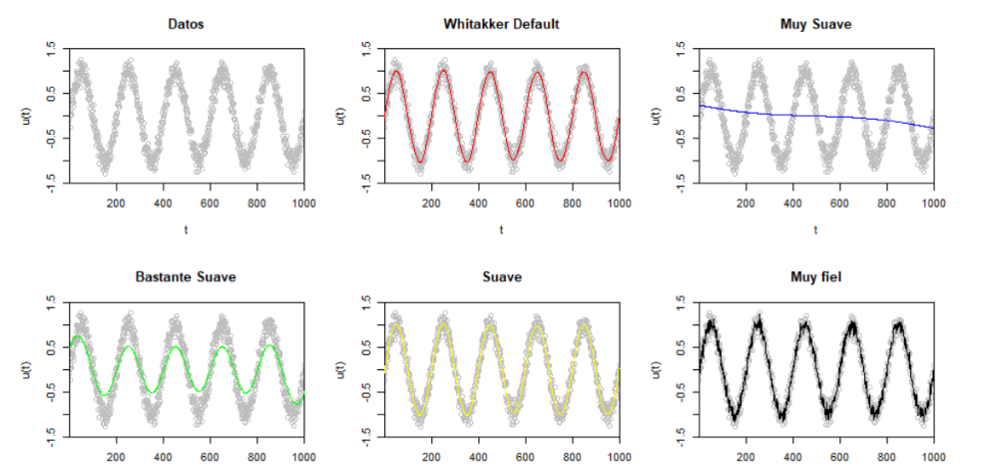

```{r setup, include=FALSE}
knitr::opts_chunk$set(echo = TRUE)

# Importo las librerias
library(pracma)
```

## Ejercicio
Genere el código necesario para generar los gráficos de la imagen siguiente

{}

```{r}
#Cargo los datos
datos <- read.csv(file = 'C:/Users/COHEN/Desktop/Facultad/AnalisisNumerico/Semana 10/Suavizar.csv', header = T)
v1 <- datos[,"V1"]
```

```{r}
# Gráfico
plot(v1, col = "grey", xlab = "t", ylab = "u(t)", ylim = c(-1.5,1.5), main = "Datos")
```

```{r}
# Suavizo default
y_default <- whittaker(v1)

# Gráfico
# Hay que agregar los corchetes para que ande
# Fuente: https://stackoverflow.com/questions/40938561/plot-new-has-not-been-called-yet-error-in-rmarkdown-rstudio-1-0-44 
{plot(v1, col = "grey", xlab = "t", ylab = "u(t)", ylim = c(-1.5,1.5), main = "Whitakker Default")
lines(y_default, col = "red")}
```

```{r}
# Suavizo mucho
y_muySuave <- whittaker(v1, lambda = 10^9, d = 2)

# Gráfico
# Hay que agregar los corchetes para que ande
# Fuente: https://stackoverflow.com/questions/40938561/plot-new-has-not-been-called-yet-error-in-rmarkdown-rstudio-1-0-44 
{plot(v1, col = "grey", xlab = "t", ylab = "u(t)", ylim = c(-1.5,1.5), main = "Muy Suave")
lines(y_muySuave, col = "blue")}
```

```{r}
# Suavizo bastante
y_bastanteSuave <- whittaker(v1, lambda = 10^6, d = 2)

# Gráfico
# Hay que agregar los corchetes para que ande
# Fuente: https://stackoverflow.com/questions/40938561/plot-new-has-not-been-called-yet-error-in-rmarkdown-rstudio-1-0-44 
{plot(v1, col = "grey", xlab = "t", ylab = "u(t)", ylim = c(-1.5,1.5), main = "Bastante Suave")
lines(y_bastanteSuave, col = "green")}
```

```{r}
# Suave
y_suave <- whittaker(v1, lambda = 10^3, d = 2)

# Gráfico
# Hay que agregar los corchetes para que ande
# Fuente: https://stackoverflow.com/questions/40938561/plot-new-has-not-been-called-yet-error-in-rmarkdown-rstudio-1-0-44 
{plot(v1, col = "grey", xlab = "t", ylab = "u(t)", ylim = c(-1.5,1.5), main = "Suave")
lines(y_suave, col = "yellow")}
```

```{r}
# Muy fiel
y_muyFiel <- whittaker(v1, lambda = 0, d = 2)

# Gráfico
# Hay que agregar los corchetes para que ande
# Fuente: https://stackoverflow.com/questions/40938561/plot-new-has-not-been-called-yet-error-in-rmarkdown-rstudio-1-0-44 
{plot(v1, col = "grey", xlab = "t", ylab = "u(t)", ylim = c(-1.5,1.5), main = "Muy fiel")
lines(y_muyFiel, col = "black")}
```