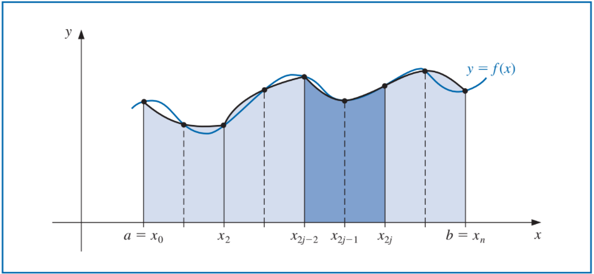

```{r setup, include=FALSE}
knitr::opts_chunk$set(echo = TRUE)
```

## Método
```{r Newton-Cortes Cerradas}
newtonCotesCerradas <- function(limiteInferior, limiteSuperior, funcion, n){
  browser()
  h <- (limiteSuperior - limiteInferior)/n
  
  fx <- rep(NA, times = (n+1))
  for (i in 1:(n+1)) {
    fx[i] <- eval(funcion, list(x = limiteInferior + (i-1)*h))
  }
  
  # Hay que cambiarlo para que quede solo con un 1
  if (n == 1){
    return((h/2) * (fx[1] + fx[2]))
  }
  else if (n == 2){
    return((h/3) * (fx[1] + 4*fx[2] + fx[3]))
  }
  else if(n == 3){
    return((3/8)*h*(fx[1] + 3*fx[2] + 3*fx[3] + fx[4]))
  }
  else if(n == 4){
    return((2/45) * h * ( 7 * fx[1] + 32 * fx[2] + 12 * fx[3] + 32 * fx[4] + 7 * fx[5]))
  }
  
}

# n = 1. Regla del trapecio.
# n = 2. Regla de Simpson.
# n = 3. Regla de tres octavos de Simpson.
# n = 4 regla de NC cerrada con n = 4.
# Poner la funcion con "x" como incognita
newtonCotesCerradas(limiteInferior = 0, limiteSuperior = 4, funcion = expression(exp(x)), n = 2)
```

```{r Newton-Cortes abiertas}
newtonCotesAbiertas <- function(limiteInferior, limiteSuperior, funcion, n){
  h <- (limiteSuperior - limiteInferior)/(n+2)
  
  fx <- rep(NA, times = (n+1))
  for (i in 1:(n+1)) {
    fx[i] <- eval(funcion, list(x = limiteInferior + i*h))
  }
  
  if (n == 0){
    return(2 * h * fx[1])
  }
  else if (n == 1){
    return((3/2)* h * (fx[1] + fx[2]))
  }
  else if(n == 2){
    return((4/3)*h*(2*fx[1] - fx[2] + 2*fx[3]))
  }
  else if(n == 3){
    return((5/24) * h * ( 11 * fx[1] + fx[2] + fx[3] + 11 * fx[4]))
  }
  
}
# n = 0. Regla del punto medio.
# n = 1. 
# n = 2. 
# n = 3.
# Poner la funcion con "x" como incognita
newtonCotesAbiertas(limiteInferior = 0, limiteSuperior = pi/4, funcion = expression(sin(x)), n = 3)
```

```{r}
SimpsonCompuesta <- function(limiteInferior, limiteSuperior, funcion, n = 2, cantIntervalos){
  # n es 2 por defecto
  # browser()
  if (cantIntervalos%%2 != 0){
    return("cantIntervalos debe ser un entero par")
  }
  
  cantIntervalos <- cantIntervalos
  
  crecimientoIntervalo <- (limiteSuperior-limiteInferior)/cantIntervalos
  
  fx <- rep(NA, times = 3)
  
  resultado <- 0
  
  
  for (i in 1:cantIntervalos) {
    limiteSuperior <- limiteInferior + crecimientoIntervalo
    
    h <- (limiteSuperior - limiteInferior)
    
    for (i in 1:3) {
      fx[i] <- eval(funcion, list(x = limiteInferior + (i-1)*h))
    }
    
    resultado <- resultado + (h/3) * (fx[1] + 4*fx[2] + fx[3])
    
    limiteInferior <- limiteSuperior
  }
  
  return(resultado)
}
```

```{r punto medio compuesta}
PuntoMedioCompuesta <- function(limiteInferior, limiteSuperior, funcion, n){
  browser()
 h <- (limiteSuperior - limiteInferior)/(n + 2)
 
 suma <- 0
 
 x <- rep(NA, times = (n+2))
 for (i in -1:(n+1)) {
   x[i+2] <- limiteInferior + (i + 1) * h
 }
 
 for (j in 1:(n/2+1)) {
   suma <- suma + eval(funcion, list(x = x[2*j]))
 }
 return(2 * h * suma)
} 

PuntoMedioCompuesta(limiteInferior = -2, limiteSuperior = 2, funcion = expression(x^3*exp(x)), n = 4)
```


```{r Regla compuesta de simpson y trapecio}
IntegracionCompuesta <- function(limiteInferior, limiteSuperior, funcion, n, cantIntervalos){
  
  #browser()
  if ((n == 2 || n == 0) && cantIntervalos%%2 != 0){
    return("cantIntervalos debe ser un entero par")
  }
  
  cantIntervalos <- cantIntervalos/n
  
  
  crecimientoIntervalo <- (limiteSuperior-limiteInferior)/cantIntervalos
  
  fx <- rep(NA, times = (n+1))
  
  resultado <- 0
  
  for (i in 1:cantIntervalos) {
    limiteSuperior <- limiteInferior + crecimientoIntervalo
    
    if (n != 0){
      h <- (limiteSuperior - limiteInferior)/n
    }
    
    
    for (i in 1:(n+1)) {
      fx[i] <- eval(funcion, list(x = limiteInferior + (i-1)*h))
    }
    
    # Trapecio
    if (n == 1){
      resultado <- resultado + (h/2) * (fx[1] + fx[2])
    }
    #Simpson
    else if(n == 2){
      resultado <- resultado + (h/3) * (fx[1] + 4*fx[2] + fx[3])
    }
    
    limiteInferior <- limiteSuperior
  }
  
  return(resultado)
}

# n = 1. Trapecio
# n = 2. Simpson
IntegracionCompuesta(limiteInferior = -2, limiteSuperior = 2, funcion = expression(x^3*exp(x)), cantIntervalos = 4, n = 1)
```


A menudo surge la necesidad de evaluar una integral definida de una función que es difícil de obtener. El método básico asociado con la aproximación de $\int_{a}^{b} f(x) dx$ recibe el nombre ed *cuadratura numérica*. Éste utiliza una suma $\sum_{i=0}^{n} a_i f(x_i)$ para aproximar $\int_{a}^{b} f(x) dx$. Los métodos de cuadratura que analizamos en esta sección se basan en los polinomios explicados en la semana 8.  

La *regla trapezoidal* y la *regla de Simpson* surgen del polinomio de Lagrange con valores equiespaciados.   

## La regla trapezoidal o regla del trapecio
Sean $x_0 = a, x_1 = b, h = b - a$

\begin{equation}
  \int_{a}^{b} f(x) dx = \dfrac{h}{2} [f(x_0) + f(x_1)] -                                                           \dfrac{h^3}{12}f''(\varepsilon)
\end{equation}

Esto recibe el nombre de regla trapezoidal porque cuando $f$ es una función con valores positivos, $\int_{a}^{b} f(x) dx$ se aporxima mediante el área de un trapecio.


El termino de error implica la derivada segunda, por lo tanto, dara resultados exactos cuando se aplique a polinomio de grado 1 o cero.

## Regla de Simpson
Sea $x_0 = a, x_2 = b y x_1 = a + h$, en donde $h = (b - a)/2$
La regla de simpson resulta de la integración sobre $[a, b]$ del segundo polinomio de Lagrange con nodos equiespaciados.


\begin{equation}
  \int_{a}^{b} f(x) dx = \dfrac{h}{3} [f(x_0) + 4 f(x_1) + f(x_2)] -                                              \dfrac{h^5}{90}f^{(4)}(\varepsilon)
\end{equation}

El término de error en la regla de Simpson implica la cuarta derivada de $f$, por lo que da resultados exactos cuando se aplica a cualquier polinomio de grado tres o menos.

## Fórmulas de Newton-Cotes cerradas
La fórmula cerrada de $n + 1$ puntos de Newton-Cotes utiliza nodos $x_i = x_0 + i * h$, para $i = 0, 1, ..., n$, donde $x_0 = a$, $x_n = b$, $h = (b-a)/n$. Recibe el nombre de cerrada porque los extremos del intervalo $[a,b]$ se incluyen como nodos.


## Fórmulas de Newton-Cotes abiertas
Las fórmulas de Newton-Cotes abiertas no incluyen a los extremos de $[a,b]$ como nodos.


## Integración numérica compuesta
En general, el uso de fórmulas de Newton-Cotes es inapropiado sobre largos intervalos de integración por la naturaleza oscilante de los polinomios interpolantes.

En integración numérica compuesta, para una integral arbitraria $\int_{a}^{b} f(x) dx$, seleccione un entero par $n$. Subdivida el intervalo $[a,b]$ en $n$ subintervalos y aplique la regla de Simpson para cada par consecutivo de intervalos.



Con $h = (b-a)/n$ y $x_j = a + j * h$, para cada $j = 0, 1, ..., n$