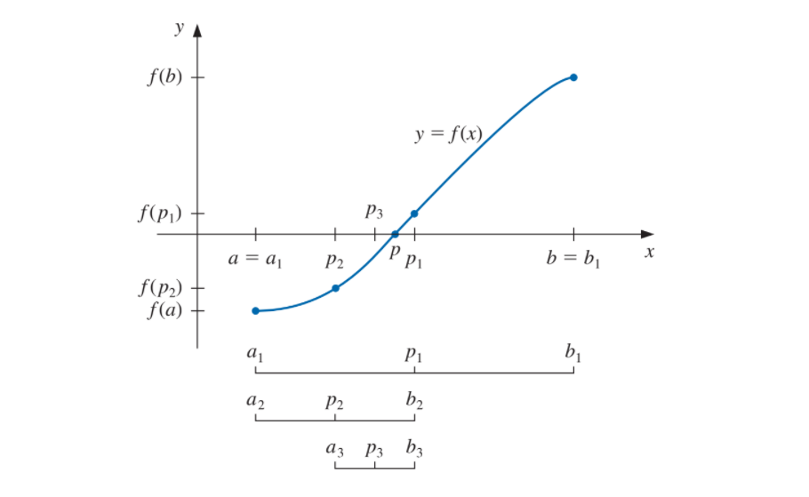

```{r setup, include=FALSE}
knitr::opts_chunk$set(echo = TRUE)
library(ggplot2)
```

## Método de Bisección

El método de bisección busca aproximar una raiz de una función cuando esta tiene la forma de *$f(x) = 0$*. Esta basada en el teorema de valor intermedio.  


### Supuestos:
* $f$ es una función continua definida dentro del intervalo $[a,b]$ con $f(a)$ y $f(b)$ de signos opuestos.
* La raiz en el intervalo es única (aunque puede operar cuando hay más de una raíz en el intervalo)

El teorema del valor intermedio implica que existe un número $p$ con $f(p) = 0$.
El método realiza una reducción a la mitad (o bisección) de los subintervalos de $[a,b]$, y en cada paso localizar la mitad que contiene $p$.

### Técnica de Bisección:
Sea $a_1 = a$ y $b_1 = b$ y sea $p_1$ el punto medio de $[a,b]$, es decir:

\begin{align*}
  p = \frac{(a_1 +a_2)}{2}
\end{align*}

Esto produce el método de la siguiente figura:

{width=70%}

```{r metodo de biseccion}
#Método de Bisección
Biseccion <- function(a, b, N = 100, tol) {
#Tiene por default 100 iteraciones
  
  #Instancio las listas vacias
  lista_a <- c(NULL)
  lista_b <- c(NULL)
  lista_p <- c(NULL)

  for (i in 1:N) {
    #Calculo P
    p <- (a+b)/2
    
    #Agrego el valor a cada lista
    lista_p[i] <- p
    lista_a[i] <- a
    lista_b[i] <- b
    
    #Evaluo la función en p
    fp <- f(p)
    
    #Si la f(p) es 0, entonces es raiz
    #O si esta dentro del límite tolerado
    if (fp == 0 | abs((b-a)/2) <= tol) {
      #Creo un data frame con las listas
      datos <- data.frame(lista_a, lista_b, lista_p)
      colnames(datos) <- c("A", "B", "P")
      print(datos)
      return(paste("La raiz es: ", p))
    }
    
    #Si comparten el mismo signo
    if (fp * f(a) > 0) {
      a <- p
    } else {
      b <- p
    }
  }
  
  #En el caso de que falle el método
  return(paste('El método falla luego de: ', N, ' iteraciones'))
}
```

### Ejercicios:

* Hallar la solución de:
  1. $cos(x) = \sqrt{x}$
  2. $x^3 + 4x^2 - 10 = 0$
  3. $2 + cos(e^x - 2) = e^x$
  4. $x^3 - 7x^2 + 14x - 6 = 0$

### Solución:

###### Ejercicio 1: $cos(x) = \sqrt{x}$


Paso la ecuación a la forma $f(x) = 0$.
\begin{align*}
  cos(x) - \sqrt{x} = 0
\end{align*}

Gráfico la ecuación para observar en que intervalo tiene la raíz  

```{r grafico ejercicio 1}

f <- function(x){
  return(cos(x)-sqrt(x))
}

#Instancio un vector que me va a indicar los puntos en la función
x <- seq(0, 10, by = 0.1)

#Genero los puntos
fx <- f(x)

#Creo un data frame con los x e y
df <- data.frame(x, fx)

#Instancio los datos
gg_fx <- ggplot(data = df)

#Agrego la capa con los datos
gg_fx <- gg_fx + aes(x = x, y = fx)

#Est grafica una linea
gg_fx <- gg_fx + geom_line(linetype = 1, colour = "darkblue")

#Agrego el eje X
gg_fx <- gg_fx + geom_vline(xintercept = 0, linetype = 1)

#Agrego el eje Y
gg_fx <- gg_fx + geom_hline(yintercept = 0, linetype = 1)

#Le modifico la escala al eje X para poder obtener un mejor intervalo
gg_fx <- gg_fx + scale_x_continuous(name = "x", breaks = seq(0, 10, by = 1))

#Grafico
gg_fx
```
Se observa que la raíz se encuentra en el intervalo $[0.5;1]$

Aplico el método:
```{r biseccion ejercicio 1}
print(Biseccion(a = 0.5, b = 1, tol =0.0001))
```
------------------------------------


###### Ejercicio 2: $x^3 + 4x^2 - 10 = 0$


Gráfico:
```{r grafico ejercicio 2}

f <- function(x){
  return(x^3 + 4*x^2 - 10)
}

#Instancio un vector que me va a indicar los puntos en la función
x <- seq(-5, 5, by =0.1)

#Genero los puntos
fx <- f(x)

#Creo un data frame con los x e y
df <- data.frame(x, fx)

#Instancio los datos
gg_fx <- ggplot(data = df)

#Agrego la capa con los datos
gg_fx <- gg_fx + aes(x = x, y = fx)

#Est grafica una linea
gg_fx <- gg_fx + geom_line(linetype = 1, colour = "darkblue")

#Agrego el eje X
gg_fx <- gg_fx + geom_vline(xintercept = 0, linetype = 1)

#Agrego el eje Y
gg_fx <- gg_fx + geom_hline(yintercept = 0, linetype = 1)

#Le modifico la escala al eje x para poder obtener un mejor intervalo
gg_fx <- gg_fx + scale_x_continuous(name = "x", breaks = seq(-5, 5, by = 1))

#Grafico
gg_fx
```
Se observa que hay una raiz en el intervalo $[1;2]$

Grafico nuevamente en el intervalo $[-3.5;-2]$ para observar si efectivamente hay un raiz en ese intervalo 

```{r ejercicio 2 grafico b}
f <- function(x){
  return(x^3 + 4*x^2 - 10)
}

#Instancio un vector que me va a indicar los puntos en la función
x <- seq(-3.5, -2, by =0.1)

#Genero los puntos
fx <- f(x)

#Creo un data frame con los x e y
df <- data.frame(x, fx)

#Instancio los datos
gg_fx <- ggplot(data = df)

#Agrego la capa con los datos
gg_fx <- gg_fx + aes(x = x, y = fx)

#Est grafica una linea
gg_fx <- gg_fx + geom_line(linetype = 1, colour = "darkblue")

#Agrego el eje X
gg_fx <- gg_fx + geom_vline(xintercept = 0, linetype = 1)

#Agrego el eje Y
gg_fx <- gg_fx + geom_hline(yintercept = 0, linetype = 1)

#Grafico
gg_fx
```
Se observa que no hay una raiz en el intervalo.

Aplico el método:
```{r biseccion ejercicio 2}
print(Biseccion(a = 1, b = 2, tol =0.0001))
```

------------------------------------

###### Ejercicio 3: $2 + cos(e^x - 2) = e^x$


Paso la ecuación a la forma $f(x) = 0$.
\begin{align*}
  2 + cos(e^x - 2) - e^x = 0
\end{align*}

Gráfico:
```{r grafico ejercicio 3}

f <- function(x){
  return(2 + cos(exp(x) - 2) - exp(x))
}

#Instancio un vector que me va a indicar los puntos en la función
x <- seq(0, 2, by = 0.1)

#Genero los puntos
fx <- f(x)

#Creo un data frame con los x e y
df <- data.frame(x, fx)

#Instancio los datos
gg_fx <- ggplot(data = df)

#Agrego la capa con los datos
gg_fx <- gg_fx + aes(x = x, y = fx)

#Est grafica una linea
gg_fx <- gg_fx + geom_line(linetype = 1, colour = "darkblue")

#Agrego el eje X
gg_fx <- gg_fx + geom_vline(xintercept = 0, linetype = 1)

#Agrego el eje Y
gg_fx <- gg_fx + geom_hline(yintercept = 0, linetype = 1)

#Le modifico la escala al eje X para poder obtener un mejor intervalo
gg_fx <- gg_fx + scale_x_continuous(name = "x", breaks = seq(0, 100, by = 1))

#Grafico
gg_fx
```

Se observa que la raíz se encuentra en el intervalo $[0;2]$ 
Aplico el método:
```{r biseccion ejercicio 3}
print(Biseccion(a = 0, b = 2, tol =0.0001))
```

------------------------------------

###### Ejercicio 4: $x^3 - 7x^2 + 14x - 6 = 0$


Gráfico:
```{r grafico ejercicio 4}

f <- function(x){
  return(x^3 - 7*x^2 + 14*x - 6)
}

#Instancio un vector que me va a indicar los puntos en la función
x <- seq(0, 5, by = 0.1)

#Genero los puntos
fx <- f(x)

#Creo un data frame con los x e y
df <- data.frame(x, fx)

#Instancio los datos
gg_fx <- ggplot(data = df)

#Agrego la capa con los datos
gg_fx <- gg_fx + aes(x = x, y = fx)

#Est grafica una linea
gg_fx <- gg_fx + geom_line(linetype = 1, colour = "darkblue")

#Agrego el eje X
gg_fx <- gg_fx + geom_vline(xintercept = 0, linetype = 1)

#Agrego el eje Y
gg_fx <- gg_fx + geom_hline(yintercept = 0, linetype = 1)

#Grafico
gg_fx
```
Al ser un polinomio completo de grado 3 tiene 3 raices.

Se observa una raiz en el intervalo $[0;1]$

Le modifico la escala al grafico para obtener una mejor aproximación de donde se ubican las dos restantesa
```{r ejercicio 4.b}
#Instancio un vector que me va a indicar los puntos en la función
x <- seq(2.5, 3.5, by = 0.1)

#Genero los puntos
fx <- f(x)

#Creo un data frame con los x e y
df <- data.frame(x, fx)

#Instancio los datos
gg_fx <- ggplot(data = df)

#Agrego la capa con los datos
gg_fx <- gg_fx + aes(x = x, y = fx)

#Est grafica una linea
gg_fx <- gg_fx + geom_line(linetype = 1, colour = "darkblue")

#Agrego el eje X
gg_fx <- gg_fx + geom_vline(xintercept = 0, linetype = 1)

#Agrego el eje Y
gg_fx <- gg_fx + geom_hline(yintercept = 0, linetype = 1)

#Grafico
gg_fx
```
Se observa que tiene una raiz en el intervalo $[2.75;3.25]$ y otra en el intervalo $[3.26;3.5]$ 


Aplico el método para el intervalo $[0;1]$:
```{r biseccion ejercicio 4.a}
print(Biseccion(a = 0, b = 1, tol =0.0001))
```

Aplico el método para el intervalo $[2.75;3.25]$:
```{r biseccion ejercicio 4.b}
print(Biseccion(a = 2.75, b = 3.25, tol =0.0001))
```

Aplico el método para el intervalo $[3.26;3.5]$:
```{r biseccion ejercicio 4.c}
print(Biseccion(a = 3.26, b = 3.5, tol =0.0001))
```