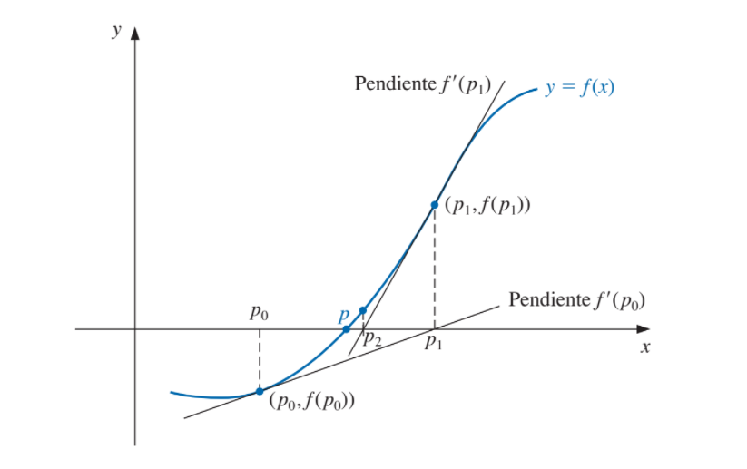

```{r setup, include=FALSE}
knitr::opts_chunk$set(echo = TRUE)
library(ggplot2)

#saco la notacion científica
options(scipen=999)
```


## Método de Newton-Raphson
El método de la forma presentada en el libro esta basada en los polinomios de Taylor.  \

Supongamos que $p_0$ existe en un intervalo $[a;b]$ y es una aproximación para $p$, de tal forma que $f'(p_0)$ $\neq$ 0 y $|p-p_0|$ es "pequeño". Consideremos e primer polinomio de Taylor expandido de $p_0$ y evaluado en $x = p$:
\begin{align*}
  f(p) = f(p_0) + (p - p_0) * f'(p_0) + \frac{(p - p_0)^2}{2} * f''(\xi(p))
\end{align*}
Puesto que, $f(p) = 0$ y $(p - p_0)^2$ es pequeño, reexpresamos de modo que:
\begin{align*}
  p = p_0 - \frac{f(p_0)}{f'(p_0)}
\end{align*}



```{r método de Newton-Raphson}
Newton <- function(p0, tol, n = 100){
  #Donde p0 es la aproximación inicial
  #El número máximo de iteraciones n viene por default en 100
  #Y tol es la toleranacia al error
  
  for (i in 1:n) {
    
    #Calculo p
    p <- p0 - (f(p0)/fprima(p0))
    
    if(abs(p-p0) <= tol){
      return(p)
    }
    
    p0 <- p
    
  }
  
  #En el caso de que falle el método
  return(paste('El método falla luego de: ', n, ' iteraciones'))
}

```

En el libro se presenta como el método mas eficaz ¿eso es realmente así? sí, pero hay que tener algo en cuenta. Al comienzo supusimos que el término $(p-p_0)^2$ es tan pequeño, que es despreciable. Esto implica que la primera aproximación de p, necesariamente, es buena. 

### Ejercicios:
* Hallar las soluciones de (si es posible):
  1. $e^x + 2^\frac{-x}{} + 2cos(x)-6 = 0$   $\hspace{12px}$  $1 \leq x \leq 2$
  2. $ln(x-1) + cos(x-1) = 0$ $\hspace{12px}$  $1.3 \leq x \leq 2$
  3. $2x * cos(2x) - (x-2)^2 = 0$ $\hspace{12px}$  $2 \leq x \leq 3$ and $3 \leq x \leq 4$
  4. $(x-2)^2 - ln(x) = 0$ $\hspace{12px}$  $1 \leq x \leq 2$ and $e \leq x \leq 4$
  5. $e^x - 3x^2 = 0$ $\hspace{12px}$  $0 \leq x \leq 1$ and $3 \leq x \leq 5$
  6. $sin(x) - e^\frac{-x}{} = 0$ $\hspace{12px}$  $0 \leq x \leq 1$ and $3 \leq x \leq 4$ and $6 \leq x \leq 7$
  7. $cos(x) = \sqrt(x)$
  8. $2 + cos(e^x - 2) = e^x$
  9. $x^3 - 7x^2 + 14x - 6 = 0$
  10. $-x^3 - cos(x) = 0$
  
### Solución:

###### Ejercicio 1:

```{r grafico del ejercicio 1}
f <- function(x){
  return(exp(x) + 2^(-x) + 2*cos(x)-6)
}

#Instancio un vector que me va a indicar los puntos en la función
x <- seq(0, 3, by = 0.01)

#Genero los puntos
fx <- f(x)

#Creo un data frame con los x e y
df <- data.frame(x, fx)

#Instancio los datos
gg_fx <- ggplot(data = df)

#Agrego la capa con los datos
gg_fx <- gg_fx + aes(x = x, y = fx)

#Est grafica una linea
gg_fx <- gg_fx + geom_line(linetype = 1, colour = "darkblue")

#Agrego el eje X
gg_fx <- gg_fx + geom_vline(xintercept = 0, linetype = 1)

#Agrego el eje Y
gg_fx <- gg_fx + geom_hline(yintercept = 0, linetype = 1)

#Grafico
gg_fx
```

```{r método ejercicio 1}
fprima <- D(expression(exp(x) + 2^(-x) + 2*cos(x)-6), "x")

fprima

fprima <- function(x){
  return(exp(x) - 2^(-x) * log(2) - 2 * sin(x))
}

Newton(p0 = 1.5, tol = 0.001)
```

###### Ejercicio 2:

```{r grafico del ejercicio 2}
f <- function(x){
  return( log(x-1) + cos(x-1))
}

#Instancio un vector que me va a indicar los puntos en la función
x <- seq(1.3, 2, by = 0.01)

#Genero los puntos
fx <- f(x)

#Creo un data frame con los x e y
df <- data.frame(x, fx)

#Instancio los datos
gg_fx <- ggplot(data = df)

#Agrego la capa con los datos
gg_fx <- gg_fx + aes(x = x, y = fx)

#Est grafica una linea
gg_fx <- gg_fx + geom_line(linetype = 1, colour = "darkblue")

#Agrego el eje X
gg_fx <- gg_fx + geom_vline(xintercept = 0, linetype = 1)

#Agrego el eje Y
gg_fx <- gg_fx + geom_hline(yintercept = 0, linetype = 1)

#Grafico
gg_fx
```

```{r método ejercicio 2}
fprima <- D(expression(log(x-1) + cos(x-1)), "x")

fprima

fprima <- function(x){
  return(1/(x - 1) - sin(x - 1))
}

Newton(p0 = 1.5, tol = 0.001)
```

###### Ejercicio 3:

```{r grafico del ejercicio 3}
f <- function(x){
  return( 2*x * cos(2*x) - (x-2)^2)
}

#Instancio un vector que me va a indicar los puntos en la función
x <- seq(2, 4, by = 0.01)

#Genero los puntos
fx <- f(x)

#Creo un data frame con los x e y
df <- data.frame(x, fx)

#Instancio los datos
gg_fx <- ggplot(data = df)

#Agrego la capa con los datos
gg_fx <- gg_fx + aes(x = x, y = fx)

#Est grafica una linea
gg_fx <- gg_fx + geom_line(linetype = 1, colour = "darkblue")

#Agrego el eje X
gg_fx <- gg_fx + geom_vline(xintercept = 0, linetype = 1)

#Agrego el eje Y
gg_fx <- gg_fx + geom_hline(yintercept = 0, linetype = 1)

#Grafico
gg_fx
```

```{r método ejercicio 3}
fprima <- D(expression(2*x * cos(2*x) - (x-2)^2), "x")

fprima

fprima <- function(x){
  return(2 * cos(2 * x) - 2 * x * (sin(2 * x) * 2) - 2 * (x - 2))
}

Newton(p0 = 2.2, tol = 0.001)
Newton(p0 = 3.7, tol = 0.001)
```

###### Ejercicio 4:

```{r grafico del ejercicio 4}
f <- function(x){
  return((x-2)^2 - log(x))
}

#Instancio un vector que me va a indicar los puntos en la función
x <- seq(1, 4, by = 0.01)

#Genero los puntos
fx <- f(x)

#Creo un data frame con los x e y
df <- data.frame(x, fx)

#Instancio los datos
gg_fx <- ggplot(data = df)

#Agrego la capa con los datos
gg_fx <- gg_fx + aes(x = x, y = fx)

#Est grafica una linea
gg_fx <- gg_fx + geom_line(linetype = 1, colour = "darkblue")

#Agrego el eje X
gg_fx <- gg_fx + geom_vline(xintercept = 0, linetype = 1)

#Agrego el eje Y
gg_fx <- gg_fx + geom_hline(yintercept = 0, linetype = 1)

#Grafico
gg_fx
```

```{r método ejercicio 4}
fprima <- D(expression((x-2)^2 - log(x)), "x")

fprima

fprima <- function(x){
  return(2 * (x - 2) - 1/x)
}

Newton(p0 = 1.5, tol = 0.001)
Newton(p0 = 3, tol = 0.001)
```

###### Ejercicio 5:

```{r grafico del ejercicio 5}
f <- function(x){
  return(exp(x) - 3*x^2)
}

#Instancio un vector que me va a indicar los puntos en la función
x <- seq(0, 5, by = 0.1)

#Genero los puntos
fx <- f(x)

#Creo un data frame con los x e y
df <- data.frame(x, fx)

#Instancio los datos
gg_fx <- ggplot(data = df)

#Agrego la capa con los datos
gg_fx <- gg_fx + aes(x = x, y = fx)

#Est grafica una linea
gg_fx <- gg_fx + geom_line(linetype = 1, colour = "darkblue")

#Agrego el eje X
gg_fx <- gg_fx + geom_vline(xintercept = 0, linetype = 1)

#Agrego el eje Y
gg_fx <- gg_fx + geom_hline(yintercept = 0, linetype = 1)

#Grafico
gg_fx
```

```{r método ejercicio 5}
fprima <- D(expression(exp(x) - 3*x^2), "x")

fprima

fprima <- function(x){
  return(exp(x) - 3 * (2 * x))
}

Newton(p0 = 1, tol = 0.001)
Newton(p0 = 3.5, tol = 0.001)
```

###### Ejercicio 6:

```{r grafico del ejercicio 6}
f <- function(x){
  return(sin(x) - exp(-x))
}

#Instancio un vector que me va a indicar los puntos en la función
x <- seq(0, 7, by = 0.1)

#Genero los puntos
fx <- f(x)

#Creo un data frame con los x e y
df <- data.frame(x, fx)

#Instancio los datos
gg_fx <- ggplot(data = df)

#Agrego la capa con los datos
gg_fx <- gg_fx + aes(x = x, y = fx)

#Est grafica una linea
gg_fx <- gg_fx + geom_line(linetype = 1, colour = "darkblue")

#Agrego el eje X
gg_fx <- gg_fx + geom_vline(xintercept = 0, linetype = 1)

#Agrego el eje Y
gg_fx <- gg_fx + geom_hline(yintercept = 0, linetype = 1)

#Grafico
gg_fx
```

```{r método ejercicio 6}
fprima <- D(expression(sin(x) - exp(-x)), "x")

fprima

fprima <- function(x){
  return(cos(x) + exp(-x))
}

Newton(p0 = 0.5, tol = 0.001)
Newton(p0 = 3.5, tol = 0.001)
Newton(p0 = 6, tol = 0.001)
```

###### Ejercicio 7:

```{r grafico del ejercicio 7}
f <- function(x){
  return(cos(x) - sqrt(x))
}

#Instancio un vector que me va a indicar los puntos en la función
x <- seq(0, 7, by = 0.1)

#Genero los puntos
fx <- f(x)

#Creo un data frame con los x e y
df <- data.frame(x, fx)

#Instancio los datos
gg_fx <- ggplot(data = df)

#Agrego la capa con los datos
gg_fx <- gg_fx + aes(x = x, y = fx)

#Est grafica una linea
gg_fx <- gg_fx + geom_line(linetype = 1, colour = "darkblue")

#Agrego el eje X
gg_fx <- gg_fx + geom_vline(xintercept = 0, linetype = 1)

#Agrego el eje Y
gg_fx <- gg_fx + geom_hline(yintercept = 0, linetype = 1)

#Grafico
gg_fx
```

```{r método ejercicio 7}
fprima <- D(expression(cos(x) - sqrt(x)), "x")

fprima

fprima <- function(x){
  return(-(sin(x) + 0.5 * x^-0.5))
}

Newton(p0 = 0.5, tol = 0.001)
```

###### Ejercicio 8:

```{r grafico del ejercicio 8}
f <- function(x){
  return(2 + cos(exp(x) - 2) - exp(x))
}

#Instancio un vector que me va a indicar los puntos en la función
x <- seq(0, 7, by = 0.1)

#Genero los puntos
fx <- f(x)

#Creo un data frame con los x e y
df <- data.frame(x, fx)

#Instancio los datos
gg_fx <- ggplot(data = df)

#Agrego la capa con los datos
gg_fx <- gg_fx + aes(x = x, y = fx)

#Est grafica una linea
gg_fx <- gg_fx + geom_line(linetype = 1, colour = "darkblue")

#Agrego el eje X
gg_fx <- gg_fx + geom_vline(xintercept = 0, linetype = 1)

#Agrego el eje Y
gg_fx <- gg_fx + geom_hline(yintercept = 0, linetype = 1)

#Grafico
gg_fx
```

```{r método ejercicio 8}
fprima <- D(expression(2 + cos(exp(x) - 2) - exp(x)), "x")

fprima

fprima <- function(x){
  return(-(sin(exp(x) - 2) * exp(x) + exp(x)))
}

Newton(p0 = 1, tol = 0.1)
```

###### Ejercicio 9:

```{r grafico del ejercicio 9}
f <- function(x){
  return(x^3 - 7*x^2 + 14*x - 6)
}

#Instancio un vector que me va a indicar los puntos en la función
x <- seq(0, 7, by = 0.1)

#Genero los puntos
fx <- f(x)

#Creo un data frame con los x e y
df <- data.frame(x, fx)

#Instancio los datos
gg_fx <- ggplot(data = df)

#Agrego la capa con los datos
gg_fx <- gg_fx + aes(x = x, y = fx)

#Est grafica una linea
gg_fx <- gg_fx + geom_line(linetype = 1, colour = "darkblue")

#Agrego el eje X
gg_fx <- gg_fx + geom_vline(xintercept = 0, linetype = 1)

#Agrego el eje Y
gg_fx <- gg_fx + geom_hline(yintercept = 0, linetype = 1)

#Grafico
gg_fx
```

```{r método ejercicio 9}
fprima <- D(expression(x^3 - 7*x^2 + 14*x - 6), "x")

fprima

fprima <- function(x){
  return(3 * x^2 - 7 * (2 * x) + 14)
}

Newton(p0 = 0.5, tol = 0.001)
Newton(p0 = 3, tol = 0.001)
Newton(p0 = 3.5, tol = 0.001)
```

###### Ejercicio 10:

```{r grafico del ejercicio 10}
f <- function(x){
  return(-x^3 - cos(x))
}

#Instancio un vector que me va a indicar los puntos en la función
x <- seq(-2, 0, by = 0.01)

#Genero los puntos
fx <- f(x)

#Creo un data frame con los x e y
df <- data.frame(x, fx)

#Instancio los datos
gg_fx <- ggplot(data = df)

#Agrego la capa con los datos
gg_fx <- gg_fx + aes(x = x, y = fx)

#Est grafica una linea
gg_fx <- gg_fx + geom_line(linetype = 1, colour = "darkblue")

#Agrego el eje X
gg_fx <- gg_fx + geom_vline(xintercept = 0, linetype = 1)

#Agrego el eje Y
gg_fx <- gg_fx + geom_hline(yintercept = 0, linetype = 1)

#Grafico
gg_fx
```

```{r método ejercicio 10}
fprima <- D(expression(-x^3 - cos(x)), "x")

fprima

fprima <- function(x){
  return(-(3 * x^2 - sin(x)))
}

Newton(p0 = -0.6, tol = 0.001)
```