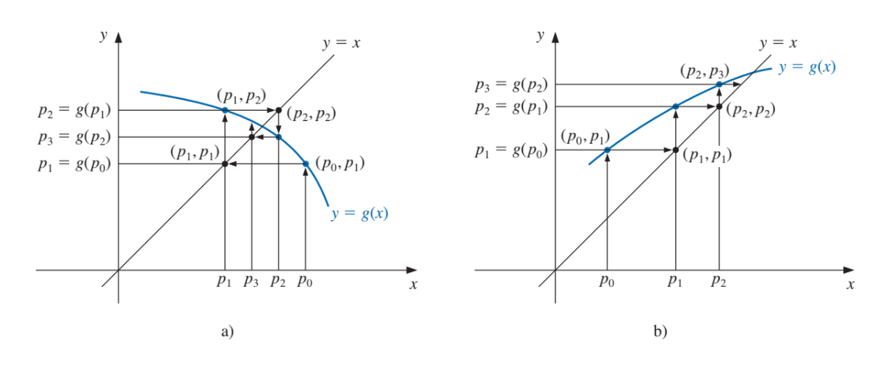

```{r setup, include=FALSE}
knitr::opts_chunk$set(echo = TRUE)
library(ggplot2)
```

## Método de punto fijo
Un punto fijo para una función es un número en el que el valor de la función no cambia cuando se apica la función. Decimos quqe el número $p$ es un punto fijo para una función dada $g$ si $g(p) = p$

Los problemas para enontrar la raíz y los de punto fijo son equivalentes en el siguiente sentido:

Dado un problema para encontrar la raíz $f(p) = 0$, podemos definir las funciones $g$ con un punto fijo en $p$ en diferentes formas, por ejemplo:
\begin{align*}
  g(x) = x - f(x)
\end{align*}
Si la función $g$ tiene un punto fijo en $p$, entonces la función tiene un cero en $p$.

### Teorema:

1. Si la función es continua en el intervalo $[a;b]$
2. Si, ademas, $g'(x)$ existe en todo $(a;b)$ y hay una constante $0 < k < 1$ con:
\begin{align*}
  |g'(x)| \leq k
\end{align*}


### Método de iteración de punto fijo:



```{r metodo de punto fijo}
#Método de punto fijo
PuntoFijo <- function(p0, n = 100, tol){
  #Donde p0 es la aproximación inicial
  #El número máximo de iteraciones n viene por default en 100
  #Y tol es la toleranacia al error
  
  #Instancio las listas vacias
  lista_p <- c(NULL)
  lista_gp <- c(NULL)
  
  for (i in 1:n) {
    #Calculo p
    p <- f(p0)
    
    lista_p[i] <- p0
    lista_gp[i] <- p
    
    if(abs(p-p0) <= tol){
      #Creo un data frame con las listas
      datos <- data.frame(lista_p, lista_gp)
      colnames(datos) <- c("P", "G(P)")
      print(datos)
      return(paste("La raiz es: ", p))
    }
    
    p0 <- p
  }
  
  #En el caso de que falle el método
  return(paste('El método falla luego de: ', n, ' iteraciones'))
}
```

Es muy importante dejar expresadas las ecuaciones con la forma de punto fijo:
\begin{align*}
  x = g(x)
\end{align*}
No todas las formas de la expresión pueden ser correctas, la ecuación puede resultar en un punto fijo, diverger o volverse indefinida dependiendo de el cumplimiento del teorema.

### Ejercicios:
* Aplicar directamente el algoritmo:
  1. $x = g_1(x) = x - x^3 - 4x^2 + 10$
  2. $x = g_2(x) = (\frac{10}{x} - 4x)^\frac{1}{2}$
  3. $x = g_3(x) = \frac{1}{2}(10-x^3)^\frac{1}{2}$
  4. $x = g_4(x) = (\frac{10}{4+x})^\frac{1}{2}$
  5. $x = g_5(x) = x - \frac{x^3+4x^2-10}{3x^2+8x}$  \

* Reescribir como problemas de punto fijo y hallar la solución de:
  1. $cos(x) = \sqrt{x}$
  2. $x^3 + 4x^2 - 10 = 0$
  3. $2 + cos(e^x - 2) = e^x$
  4. $x^3 - 7x^2 + 14x - 6 = 0$


### Solución:

Aplicando directamente el algoritmo:  

Grafico la función:

$x = g_1(x) = x - x^3 - 4x^2 + 10$ \


Al ser un polinomio completo de grado 3 debe tener 3 raices
```{r grafico del ejercicio 1.1}
f <- function(x){
  return(x - x^3 - 4*x^2 + 10)
}

#Instancio un vector que me va a indicar los puntos en la función
x <- seq(-4, 2, by = 1)

#Genero los puntos
fx <- f(x)

#Creo un data frame con los x e y
df <- data.frame(x, fx)

#Instancio los datos
gg_fx <- ggplot(data = df)

#Agrego la capa con los datos
gg_fx <- gg_fx + aes(x = x, y = fx)

#Est grafica una linea
gg_fx <- gg_fx + geom_line(linetype = 1, colour = "darkblue")

#Agrego el eje X
gg_fx <- gg_fx + geom_vline(xintercept = 0, linetype = 1)

#Agrego el eje Y
gg_fx <- gg_fx + geom_hline(yintercept = 0, linetype = 1)

#Grafico
gg_fx
```
Se observa graficamente que hay raices en los siguientes intervalos $[-4;-3]$, $[2.5;1.5]$ y $[1;2]$.


Evaluo el método con $p_0 = 1$
```{r método ejercicio 1.1}
this_could_go_wrong <- tryCatch(
  print(PuntoFijo(p0 = 1, tol = 0.0001)),
  error = function(e){print("Error")})
```


Tira error porque probablemente no cumpla con las condiciones del teorema. Vamos a comprobarlo:

1. Se observa graficamente que la función es continua en todo el intervalo.
2. Evaluo la derivada en diferentes puntos del intervalo $[1, 2]$
```{r ejercicio 1.1 derivada}

fprima <- D(expression(x - x^3 - 4*x^2 + 10), "x")

fprima

fprima <- function(x){
  return(1-3*x^2-4*(2*x))
}

x <- seq(1, 2, by =0.1)

#Genero los puntos
fprimax <- fprima(x)

#Creo un data frame con los x e y
df <- data.frame(x, fprimax)

#Lo imprimo
df
```
Se observa que no cumple con:
\begin{align*}
  |g'(x)| \leq 1
\end{align*}

Reexpreso la ecuación: 
\begin{align*}
  x = \frac{1}{2}*(10-x^3)^\frac{1}{2}
\end{align*}

Grafico ambas funciones:

```{r grafico del ejercicio 1.1 con dos lineas}
f <- function(x){
  return(x - x^3 - 4*x^2 + 10)
}

g <- function(x){
  return((1/4*(x-x^3+10))^(1/2)-x)
}

#Instancio un vector que me va a indicar los puntos en la función
x <- seq(0, 2, by = 0.1)

#Genero los puntos
fx <- f(x)
gx <- g(x)

#Creo un data frame con los x e y
df <- data.frame(x, fx)

#Instancio los datos
gg_fx <- ggplot(data = df)

#Agrego la capa con los datos
gg_fx <- gg_fx + aes(x = x, y = fx)

#Est grafica una linea
gg_fx <- gg_fx + geom_line(linetype = 1, colour = "darkblue") + geom_line(aes(y = gx), color = "darkred")

#Agrego el eje X
gg_fx <- gg_fx + geom_vline(xintercept = 0, linetype = 1)

#Agrego el eje Y
gg_fx <- gg_fx + geom_hline(yintercept = 0, linetype = 1)

#Le cambio la escala al eje X para tener una mejor visual
gg_fx <- gg_fx + scale_x_continuous(name = "x", breaks = seq(0, 1.5, by = 0.1))

#Grafico
gg_fx
```
Podemos estimar un $p_0 = 1.4$ para la nueva ecuación  \

```{r método ejercicio 1.1 raiz 1}
#Tengo que volver a instanciar f con la nueva función porque el método de punto fijo eta definida para esta
f <- function(x){
  #Es muy importante notar que cuando escribo la expresión reexpresada no lleva el -x al final
  return((1/4*(x-x^3+10))^(1/2))
}

this_could_go_wrong <- tryCatch(
  print(PuntoFijo(p0 = 1.4, tol = 0.0001)),
  error = function(e){print("Error")})
```