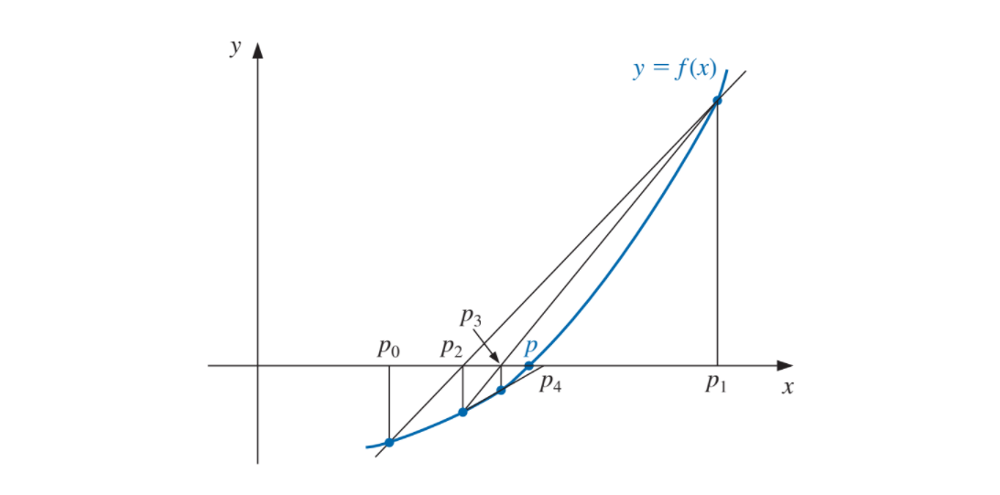

```{r setup, include=FALSE}
knitr::opts_chunk$set(echo = TRUE)
library(ggplot2)
```

## Método de la secante
El método de Newton es una técnica en extremo poderosa pero tiene una debilidad importante: la necesidad de conocer el valor de la derivada de $f$ en cada aproximación. Para evitar este problema, se presenta el método de la secante, que es similiar al método de Newton pero con una variación. En lugar de realizar el calculo de la derivada, se aplica la definición utilizando el límite. Obtenemos:

\begin{align*}
  p_n = p(n-1) - \frac{f(p(n-1)) * (p(n-1) - p(n-2))}{f(p(n-1)) - f(p(n-2))}
\end{align*}



```{r método de la secante}

Secante <- function(p0, p1, tol, n = 100){
  
  q0 = f(p0)
  q1 = f(p1)
  
  for (i in 2:n) {
    
    p = p1 - q1 * (p1 - p0) / (q1 - q0)
    
    if (abs(p-p1) < tol){
      return(p)
    }
    
    p0 = p1
    q0 = q1
    p1 = p
    q1 = f(p)
    
  }
  
  return(paste("El método falló luego de ", n, " iteraciones"))
}

```

### Ejercicios:
* Hallar las soluciones de (si es posible):
  1. $e^x + 2^\frac{-x}{} + 2cos(x)-6 = 0$   $\hspace{12px}$  $1 \leq x \leq 2$
  2. $ln(x-1) + cos(x-1) = 0$ $\hspace{12px}$  $1.3 \leq x \leq 2$
  3. $2x * cos(2x) - (x-2)^2 = 0$ $\hspace{12px}$  $2 \leq x \leq 3$ and $3 \leq x \leq 4$
  4. $(x-2)^2 - ln(x) = 0$ $\hspace{12px}$  $1 \leq x \leq 2$ and $e \leq x \leq 4$
  5. $e^x - 3x^2 = 0$ $\hspace{12px}$  $0 \leq x \leq 1$ and $3 \leq x \leq 5$
  6. $sin(x) - e^\frac{-x}{} = 0$ $\hspace{12px}$  $0 \leq x \leq 1$ and $3 \leq x \leq 4$ and $6 \leq x \leq 7$
  7. $cos(x) = \sqrt(x)$
  8. $2 + cos(e^x - 2) = e^x$
  9. $x^3 - 7x^2 + 14x - 6 = 0$
  10. $-x^3 - cos(x) = 0$

### Solución:

###### Ejercicio 1:

```{r grafico del ejercicio 1}
f <- function(x){
  return(exp(x) + 2^(-x) + 2*cos(x)-6)
}

#Instancio un vector que me va a indicar los puntos en la función
x <- seq(0, 3, by = 0.01)

#Genero los puntos
fx <- f(x)

#Creo un data frame con los x e y
df <- data.frame(x, fx)

#Instancio los datos
gg_fx <- ggplot(data = df)

#Agrego la capa con los datos
gg_fx <- gg_fx + aes(x = x, y = fx)

#Est grafica una linea
gg_fx <- gg_fx + geom_line(linetype = 1, colour = "darkblue")

#Agrego el eje X
gg_fx <- gg_fx + geom_vline(xintercept = 0, linetype = 1)

#Agrego el eje Y
gg_fx <- gg_fx + geom_hline(yintercept = 0, linetype = 1)

#Grafico
gg_fx
```

```{r método ejercicio 1}
Secante(p0 = 1, p1 = 3, tol = 0.001)
```

###### Ejercicio 2:

```{r grafico del ejercicio 2}
f <- function(x){
  return( log(x-1) + cos(x-1))
}

#Instancio un vector que me va a indicar los puntos en la función
x <- seq(1.3, 2, by = 0.01)

#Genero los puntos
fx <- f(x)

#Creo un data frame con los x e y
df <- data.frame(x, fx)

#Instancio los datos
gg_fx <- ggplot(data = df)

#Agrego la capa con los datos
gg_fx <- gg_fx + aes(x = x, y = fx)

#Est grafica una linea
gg_fx <- gg_fx + geom_line(linetype = 1, colour = "darkblue")

#Agrego el eje X
gg_fx <- gg_fx + geom_vline(xintercept = 0, linetype = 1)

#Agrego el eje Y
gg_fx <- gg_fx + geom_hline(yintercept = 0, linetype = 1)

#Grafico
gg_fx
```

```{r método ejercicio 2}
Secante(p0 = 1.4, p1 = 1.9, tol = 0.001)
```

###### Ejercicio 3:

```{r grafico del ejercicio 3}
f <- function(x){
  return( 2*x * cos(2*x) - (x-2)^2)
}

#Instancio un vector que me va a indicar los puntos en la función
x <- seq(2, 4, by = 0.01)

#Genero los puntos
fx <- f(x)

#Creo un data frame con los x e y
df <- data.frame(x, fx)

#Instancio los datos
gg_fx <- ggplot(data = df)

#Agrego la capa con los datos
gg_fx <- gg_fx + aes(x = x, y = fx)

#Est grafica una linea
gg_fx <- gg_fx + geom_line(linetype = 1, colour = "darkblue")

#Agrego el eje X
gg_fx <- gg_fx + geom_vline(xintercept = 0, linetype = 1)

#Agrego el eje Y
gg_fx <- gg_fx + geom_hline(yintercept = 0, linetype = 1)

#Grafico
gg_fx
```

```{r método ejercicio 3}
Secante(p0 = 2, p1 = 2.5, tol = 0.001)
Secante(p0 = 3.5, p1 = 4, tol = 0.001)
```

###### Ejercicio 4:

```{r grafico del ejercicio 4}
f <- function(x){
  return((x-2)^2 - log(x))
}

#Instancio un vector que me va a indicar los puntos en la función
x <- seq(1, 4, by = 0.01)

#Genero los puntos
fx <- f(x)

#Creo un data frame con los x e y
df <- data.frame(x, fx)

#Instancio los datos
gg_fx <- ggplot(data = df)

#Agrego la capa con los datos
gg_fx <- gg_fx + aes(x = x, y = fx)

#Est grafica una linea
gg_fx <- gg_fx + geom_line(linetype = 1, colour = "darkblue")

#Agrego el eje X
gg_fx <- gg_fx + geom_vline(xintercept = 0, linetype = 1)

#Agrego el eje Y
gg_fx <- gg_fx + geom_hline(yintercept = 0, linetype = 1)

#Grafico
gg_fx
```

```{r método ejercicio 4}
Secante(p0 = 1, p1 = 2, tol = 0.001)
Secante(p0 = exp(1), p1 = 4, tol = 0.001)
```

###### Ejercicio 5:

```{r grafico del ejercicio 5}
f <- function(x){
  return(exp(x) - 3*x^2)
}

#Instancio un vector que me va a indicar los puntos en la función
x <- seq(0, 5, by = 0.1)

#Genero los puntos
fx <- f(x)

#Creo un data frame con los x e y
df <- data.frame(x, fx)

#Instancio los datos
gg_fx <- ggplot(data = df)

#Agrego la capa con los datos
gg_fx <- gg_fx + aes(x = x, y = fx)

#Est grafica una linea
gg_fx <- gg_fx + geom_line(linetype = 1, colour = "darkblue")

#Agrego el eje X
gg_fx <- gg_fx + geom_vline(xintercept = 0, linetype = 1)

#Agrego el eje Y
gg_fx <- gg_fx + geom_hline(yintercept = 0, linetype = 1)

#Grafico
gg_fx
```

```{r método ejercicio 5}
Secante(p0 = 0, p1 = 1, tol = 0.001)
Secante(p0 = 3, p1 = 5, tol = 0.001)
```

###### Ejercicio 6:

```{r grafico del ejercicio 6}
f <- function(x){
  return(sin(x) - exp(-x))
}

#Instancio un vector que me va a indicar los puntos en la función
x <- seq(0, 7, by = 0.1)

#Genero los puntos
fx <- f(x)

#Creo un data frame con los x e y
df <- data.frame(x, fx)

#Instancio los datos
gg_fx <- ggplot(data = df)

#Agrego la capa con los datos
gg_fx <- gg_fx + aes(x = x, y = fx)

#Est grafica una linea
gg_fx <- gg_fx + geom_line(linetype = 1, colour = "darkblue")

#Agrego el eje X
gg_fx <- gg_fx + geom_vline(xintercept = 0, linetype = 1)

#Agrego el eje Y
gg_fx <- gg_fx + geom_hline(yintercept = 0, linetype = 1)

#Grafico
gg_fx
```

```{r método ejercicio 6}
Secante(p0 = 0, p1 = 1, tol = 0.001)
Secante(p0 = 3, p1 = 4, tol = 0.001)
Secante(p0 = 6, p1 = 7, tol = 0.001)
```

###### Ejercicio 7:

```{r grafico del ejercicio 7}
f <- function(x){
  return(cos(x) - sqrt(x))
}

#Instancio un vector que me va a indicar los puntos en la función
x <- seq(0, 7, by = 0.1)

#Genero los puntos
fx <- f(x)

#Creo un data frame con los x e y
df <- data.frame(x, fx)

#Instancio los datos
gg_fx <- ggplot(data = df)

#Agrego la capa con los datos
gg_fx <- gg_fx + aes(x = x, y = fx)

#Est grafica una linea
gg_fx <- gg_fx + geom_line(linetype = 1, colour = "darkblue")

#Agrego el eje X
gg_fx <- gg_fx + geom_vline(xintercept = 0, linetype = 1)

#Agrego el eje Y
gg_fx <- gg_fx + geom_hline(yintercept = 0, linetype = 1)

#Grafico
gg_fx
```

```{r método ejercicio 7}
Secante(p0 = 0, p1 = 0.5, tol = 0.001)
```

###### Ejercicio 8:

```{r grafico del ejercicio 8}
f <- function(x){
  return(2 + cos(exp(x) - 2) - exp(x))
}

#Instancio un vector que me va a indicar los puntos en la función
x <- seq(0, 7, by = 0.1)

#Genero los puntos
fx <- f(x)

#Creo un data frame con los x e y
df <- data.frame(x, fx)

#Instancio los datos
gg_fx <- ggplot(data = df)

#Agrego la capa con los datos
gg_fx <- gg_fx + aes(x = x, y = fx)

#Est grafica una linea
gg_fx <- gg_fx + geom_line(linetype = 1, colour = "darkblue")

#Agrego el eje X
gg_fx <- gg_fx + geom_vline(xintercept = 0, linetype = 1)

#Agrego el eje Y
gg_fx <- gg_fx + geom_hline(yintercept = 0, linetype = 1)

#Grafico
gg_fx
```

```{r método ejercicio 8}
Secante(p0 = 0, p1 = 2, tol = 0.001)
```

###### Ejercicio 9:

```{r grafico del ejercicio 9}
f <- function(x){
  return(x^3 - 7*x^2 + 14*x - 6)
}

#Instancio un vector que me va a indicar los puntos en la función
x <- seq(0, 7, by = 0.1)

#Genero los puntos
fx <- f(x)

#Creo un data frame con los x e y
df <- data.frame(x, fx)

#Instancio los datos
gg_fx <- ggplot(data = df)

#Agrego la capa con los datos
gg_fx <- gg_fx + aes(x = x, y = fx)

#Est grafica una linea
gg_fx <- gg_fx + geom_line(linetype = 1, colour = "darkblue")

#Agrego el eje X
gg_fx <- gg_fx + geom_vline(xintercept = 0, linetype = 1)

#Agrego el eje Y
gg_fx <- gg_fx + geom_hline(yintercept = 0, linetype = 1)

#Grafico
gg_fx
```

```{r método ejercicio 9}
Secante(p0 = 0, p1 = 0.5, tol = 0.001)
Secante(p0 = 2.9, p1 = 3, tol = 0.001)
Secante(p0 = 3.4, p1 = 3.5, tol = 0.001)
```

###### Ejercicio 10:

```{r grafico del ejercicio 10}
f <- function(x){
  return(-x^3 - cos(x))
}

#Instancio un vector que me va a indicar los puntos en la función
x <- seq(-2, 0, by = 0.01)

#Genero los puntos
fx <- f(x)

#Creo un data frame con los x e y
df <- data.frame(x, fx)

#Instancio los datos
gg_fx <- ggplot(data = df)

#Agrego la capa con los datos
gg_fx <- gg_fx + aes(x = x, y = fx)

#Est grafica una linea
gg_fx <- gg_fx + geom_line(linetype = 1, colour = "darkblue")

#Agrego el eje X
gg_fx <- gg_fx + geom_vline(xintercept = 0, linetype = 1)

#Agrego el eje Y
gg_fx <- gg_fx + geom_hline(yintercept = 0, linetype = 1)

#Grafico
gg_fx
```

```{r método ejercicio 10}
Secante(p0 = -1, p1 = -0.75, tol = 0.001)

```