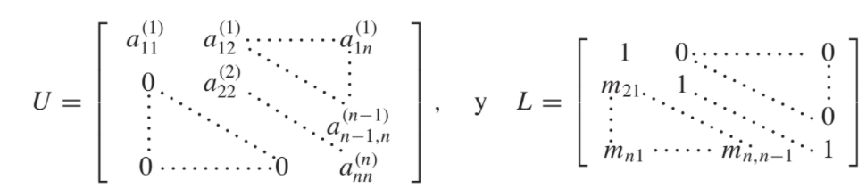

```{r setup, include=FALSE}
knitr::opts_chunk$set(echo = TRUE)
```

La factorización es especialmente útil cuando se tiene la forma $A = LU$, donde $L$ es triangular inferior y $U$ es triangular superior. Resolver $Ax = b$ es equivalente a resolver $LUx = b$

Suponga que $A$ se ha factorizado en la forma triangular $A = LU$. Entonces podemos resulver $x$ con mayor facilidad a través de un proceso de dos pasos:\
1. Primero, hacemos $y = Ux$ y resolvemos el sistema triangular superior $Ly = b$ para $y$.\
2. Una vez que conocemos $y$, resolvemos el sistema triangular superior $Ux = y$.

## Teorema:

Si la eliminación gaussiana se puede realizar en el sistema lineal $Ax = b$ sin intercamios de fila, entonces la matriz $A$ se puede factorizar en el producto de una matriz triangular inferior $L$ y una matriz triangular superior $U$, es decir, $A = LU$, donde $m_{ji} = a_{ji} / a_{ii}$



Clarificando un poco lo que menciona el libro: $A = LU$, por ende, $Ax = LUx$. Teniendo en cuenta el paso 1: $Ly = b$. Resolvemos $y$. Ahora, $Ux = y$, y despejamos x.

```{r factorizacion LU a mi manera INCOMPLETO}

factorizacionLU <- function(matriz_coeficientes, vector_resultados){
  
  n_incognitas <- nrow(vector_resultados)
  
  #Calculo la matriz U
  U <- matriz_coeficientes
  for (i in 1:(n_incognitas-1)) {
    #La hago triangular inferior
    for (k in (i+1):n_incognitas) {
      U[k,] <- U[k,] - (U[k,i]/U[i,i]) * U[i,]
    }
  }
  
  #Calculo la matriz L
  L <- matriz_coeficientes
  #Hago unos en la diagonal principal
  for (i in (n_incognitas-1):1) {
    L[i,] <- L[i,]/L[i,i]
    
    #La hago triangular inferior
    for (k in n_incognitas:(i-1)) {
      L[k,] <- L[k,] + L[k,i] * L[i,]
    }
  }
  
  #print(matriz_coeficientes)
  #print(U)
  print(L)
  
}

A <- matrix(c(1, 1, 0, 3,
              2, 1, -1, 1,
              3, -1, -1, 2,
              -1, 2, 3, -1), nrow = 4, ncol = 4, byrow = TRUE)

b <- matrix(c(8, 7, 14, -7), nrow = 4, ncol = 1, byrow = TRUE)

factorizacionLU(matriz_coeficientes = A, vector_resultados = b)

```

```{r factorizacion LU algoritmo libro}

LU <- function(matriz_coeficientes){
  n_incognitas = nrow(matriz_coeficientes)
  
  L <- matrix(rep(0, times = n_incognitas^2), nrow = n_incognitas, ncol = n_incognitas, byrow = TRUE)
  U <- matrix(rep(0, times = n_incognitas^2), nrow = n_incognitas, ncol = n_incognitas, byrow = TRUE)
  
  # -------- PASO 1
  for (i in 1:(n_incognitas-1)) {
    #Completo con 1 la diagonal principal de L.
    L[i,i] <- 1
    
    for (j in (i+1):n_incognitas) {
      L[i,j] <- 0
    }
  }
  
  #El último lo completo a mano
  L[n_incognitas, n_incognitas] <- 1
  
  U[1,1] <- matriz_coeficientes[1,1]
  
  
  if(U[1,1] == 0){
    return("factorizacion imposible")
  }
  
  # -------- PASO 2
  
  for (j in 2:n_incognitas) {
    U[1,j] <- matriz_coeficientes[1,j]
    L[j,1] <- matriz_coeficientes[j,1]/U[1,1]
  }
  
  
  # -------- PASO 3
  
  for(i in 2:(n_incognitas-1)){
    
    # -------- PASO 4
    suma <- 0
    for (k in 1:(i-1)) {
      suma <- suma + L[i,k]*U[k,i]
    }
    
    U[i,i] <- matriz_coeficientes[i,i] - suma
    
    
    if(U[i,i] == 0){
      return("factorizacion imposible")
    }
    
    # -------- PASO 5
    
    for (j in (i+1):n_incognitas) {
      sumaU <- 0
      sumaL <- 0
      for (k in 1:(i-1)) {
        sumaU <- sumaU + L[i,k]*U[k,j]
        sumaL <- sumaL + L[j,k]*U[k,i]
      }
      
      U[i,j] <- (1/L[i,i])* (matriz_coeficientes[i,j] - sumaU)
      L[j,i] <- (1/U[i,i])* (matriz_coeficientes[j,i] - sumaL)
      
    }
    
    
  }
  
  
  # -------- PASO 6
  
  
  suma <- 0
  for (k in 1:(n_incognitas-1)) {
    suma <- suma + L[n_incognitas,k]*U[k,n_incognitas]
  }
  U[n_incognitas, n_incognitas] <- matriz_coeficientes[n_incognitas,n_incognitas] - suma
  
  
  # -------- PASO 7
  return(list("L" = L, "U" = U))
}

A <- matrix(c(1, 1, 0, 3,
              2, 1, -1, 1,
              3, -1, -1, 2,
              -1, 2, 3, -1), nrow = 4, ncol = 4, byrow = TRUE)

LU(matriz_coeficientes = A)

L <- LU(A)$L
U <- LU(A)$U

L%*%U


```


## Ejercicios de la guía:

### A:
```{r ejercicio 1.a}
A <- matrix(c(4, -1, 1,
              2, 5, 2,
              2, 5, 2), nrow = 3, ncol = 3, byrow = TRUE)

LU(matriz_coeficientes = A)

L <- LU(A)$L
U <- LU(A)$U

L%*%U

```


### B:
```{r ejercicio 1.b}
B <- matrix(c(4, 1, 2,
              2, 4, -1,
              1, 1, -3), nrow = 3, ncol = 3, byrow = TRUE)

LU(matriz_coeficientes = A)

L <- LU(A)$L
U <- LU(A)$U

L%*%U

```

### C:
```{r ejercicio 1.c}
C <- matrix(c(2, 1, 1,
              3, 3, 9,
              3, 3, 5), nrow = 3, ncol = 3, byrow = TRUE)

LU(matriz_coeficientes = A)

L <- LU(A)$L
U <- LU(A)$U

lu <- L%*%U
```


### D:
```{r ejercicio 1.d}
D <- matrix(c(2, 0, 0, 0,
              1, 1.5, 0, 0,
              0, -3, 0.5, 0,
              2, -2, 1, 1), nrow = 4, ncol = 4, byrow = TRUE)

LU(matriz_coeficientes = A)

L <- LU(A)$L
U <- LU(A)$U

lu <- L%*%U

```

### E:
```{r ejercicio 1.e}

E <- matrix(c(1.012, -2.132, 3.104,
              -2.132, 4.906, -7.013,
              3.104, -7.013, 0.014), nrow = 4, ncol = 4, byrow = TRUE)

LU(matriz_coeficientes = A)

L <- LU(A)$L
U <- LU(A)$U

lu <- L%*%U
```