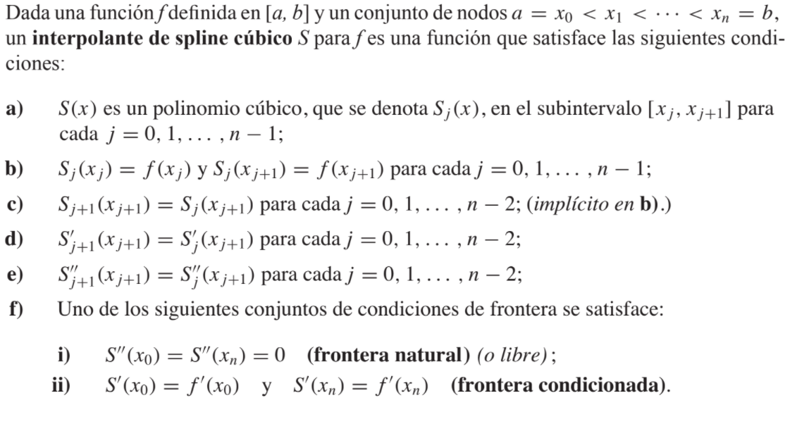

```{r setup, include=FALSE}
knitr::opts_chunk$set(echo = TRUE)
```

## Spline cúbico
Con los otros métodos realizamos aproximaciones de las funciones arbitrarias en intervalos cerrados usando un polinomio individual. Un enfoque alternativo es dividir el intervalo de aproximación en un conjunto de subintervalos y construir un polinomio de aproximación diferente para cada subintervalo. Esto se llama aproximación polinomia por tramos.

La aproximación polinomial por tramos más común usa polinomios cúbicos entre cada par sucesivo de nodos y recibe el nombre de interpolación de spline cúbico.


{width=70%}

Cuando se presentan condiciones de fronteras libres, el spline recibe el nombre de spline natural.

Como estamos hablando de spline cúbico la función va a tener la siguiente forma:  
$a_1 * x^3 + a_2 * x^2 + a_3 * x + a_4$
En cada intervalo.

```{r}
TrazadorCubicoNatural = function(x,y){
  n = length(y)
  j = n - 1
  
  a = y
  b = c(rep(NA,n))
  c = c(rep(NA,n))
  d = c(rep(NA,n))
  
  A = c(rep(NA,n))
  h = c(rep(NA,n))
  l = c(rep(NA,n))
  u = c(rep(NA,n))
  z = c(rep(NA,n))
  
  #Paso 1
  for (i in 1:j) { 
    h[i] = x[i + 1] - x[i]
  }
  
  
  #Paso 2
  for (i in 1:j) { 
    if(i != 1){
      A[i] = (3 * (a[i + 1] - a[i])/(h[i])) - (3 * (a[i] - a[i - 1]) /h[i - 1])
    }
  }
  
  
  #Paso 3
  l[1] = 1
  u[1] = 0
  z[1] = 0
  
  #Paso 4
  for (i in 2:j) {
    l[i] = 2 * (x[i + 1] - x[i - 1]) - h[i - 1] * u[i - 1]
    u[i] = h[i]/l[i]
    z[i] = (A[i] - h[i - 1] * z[i - 1])/l[i]
  }
  
  #Paso 5
  l[n] = 1
  z[n] = 0
  c[n] = 0
  
  #Paso 6
  for (i in j:1) {
    c[i] = z[i] - u[i] * c[i + 1]
    b[i] = (a[i + 1] - a[i])/h[i] - h[i] * (c[i + 1] + 2*c[i])/3
    d[i] = (c[i + 1] - c[i])/(3*h[i])
  }
  
  #Paso 7
  results = matrix(rep(NA, 4*j), nrow = j, ncol = 4, byrow = F)
  for (k in 1:j) {
    results[k, 1] = a[k]
    results[k, 2] = b[k]
    results[k, 3] = c[k]
    results[k, 4] = d[k]
  }
  
  #Construyo el polinomio
  polinomios <- rep(NA, times = nrow(results))
  for (i in 1:nrow(results)) {
    polinomios[i] <- glue::glue(results[i,1]) 
    for(j in 2:ncol(results)){
      polinomios[i] <- polinomios[i] + glue::glue(" + ", results[i,j], " * (x - ", x[i], ")^", (j-1)) 
    }
  }
  
  return(polinomios)
  
}
```

