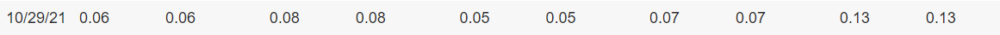

```{r setup, include=FALSE}
knitr::opts_chunk$set(echo = FALSE)
knitr::opts_chunk$set(tidy.opts=list(width.cutoff=80), tidy=TRUE)
```

```{r Ingrese Numero de Resgistro, echo=TRUE}
  # Remplace 000000 a continuación por su número de resgistro
  NroReg = 895700
```

```{r Librerias, echo=TRUE, message=FALSE, warning=FALSE}
  library(ggplot2)
  library(flextable)
  library(tidyverse)
  library(bookdown)
```

# Interpolación: curva de tasas de interés

Ingrese al siguiente sitio web para descargar las tasas de interés de la Letras del Tesoro de Estados Unidos: \textcolor{blue}{https://www.treasury.gov/resource-center/data-chart-center/interest-rates/Pages/TextView.aspx?data=billrates}.

```{r}
set.seed(NroReg)
fecha = as.Date("2021-11-10") - sample(1:30, 1)
```

Descargue las tasas del día: `r format(fecha,  '%d de %B de %Y')`^[Note que la fecha de cálculo de cada estudiante es diferente, ya que depende de su número de registro. No olvide ingresar su número de Registro en el bloque de código inicial. Todas las fechas deberían ser anteriores al 10 de noviembre de 2021. Si su fecha particular es feriado o fin de semana, considere el día hábil inmediato anterior.].

Considere únicamente las tasas “Coupon Equivalent” como una función del plazo, $r = f(t)$, donde $r$ es la tasa de interés y $t$ es el plazo (medido en años, calculado como $t=semanas/52$).


Se pide:

a. Construya el Polinomio de Interpolación de Lagrange de grado cuatro para aproximar la función $f(t)$ (debe escribir el Polinomio completo en función de $t$: $P(t)$). [Obs.: puede utilizar cualquiera de los métodos para construir el polinomio].
b. Aproxime las tasas de 4 y de 9 meses utilizando el Polinomio del punto anterior.
c. Realice un gráfico del polinomio de interpolación (cuasi) continuo para valores de $t$ desde un mes hasta un año. [Obs.: debe crear una secuencia de $t$ con al menos 365 valores, de modo que el gráfico no se vea lineal por tramos y/o con una interpolación automática de R entre los puntos calculados].
d. Construya un Trazador Cúbico Natural (*Natural Cubic Spline*) (debe escribir el trazador cúbico completo, con cada una de sus partes, en función de $t$: $S(t)$).
e. Aproxime las tasas de 4 y de 9 meses utilizando el Trazador Cúbico del punto anterior.
f. Realice un gráfico del Trazador cúbico para valores de $t$ desde un mes hasta un año. [Obs.: debe crear una secuencia de $t$ con al menos 365 valores, de modo que el gráfico no se vea lineal por tramos y/o con una interpolación automática de R entre los puntos calculados].

\newpage

## Datos Curva de Tasas {-}



```{r datos, echo=TRUE, warning=FALSE}
# Creo un data frame con las tasas de interés y las fechas
df <- data.frame(
  date             = c(4/52, 8/52, 13/52, 26/52, 1),
  couponEquivalent = c(0.06, 0.08, 0.05, 0.07, 0.13)
  )

ggplot(df) +
  geom_line(aes(x = date, y = couponEquivalent)) +
  geom_point(aes(x = date, y = couponEquivalent))
```


\newpage

## Polinomio de Lagrange
```{r Lagrange-back}
  # Ingrese aquí todo el código necesario para generar el Polinomio de Lagrange.
  # Notar que puede escribir el poliomio con la forma de "Newton" si lo desea.

# Metodo de diferencias divididas -----------------------------------------
DiferenciasDivididas <- function(x, y){
  n <- length(x)
  
  #Hago un vector vacio para llenar el df
  empty_vec <- rep(0, times = n)  
  
  df <- data.frame(x, y)
  
  for (i in 1:(n-1)) {
    
    df[glue::glue("Q",i)] <- empty_vec
    
    for (j in (i+1):n) {
      
      df[j, (i+2)] <- ( df[j,(i+1)] - df[(j-1),(i+1)])/(x[j]-x[j-i])
    }
  }
  
  return(df)
}

PolinomioInterpolanteNewton <- function(x, y){
  df <- DiferenciasDivididas(x = x, y = y)
  
  #Saco la primer columna del df
  df[,1] <- NULL
  
  n <- ncol(df)
  
  polinomio <- df[1,1]
  
  for (i in 2:n) {
    polinomio <- polinomio + glue::glue(" + ", df[i,i])
    for (j in 1:(i-1)) {
      polinomio <- polinomio + glue::glue(" * ( x - ", x[j], " )")
    }
  }
  
  return(polinomio)
}
```

```{r Lagrange-Polinomio, echo=TRUE}
  # Use este bloque para imprimir el polinomio (si lo hace con código de R).
  # Si calcula "a mano", escriba luego de este bloque.
resultado <- PolinomioInterpolanteNewton(x = df$date, y = df$couponEquivalent)
```

0.06 + 0.26 * ( x - 0.0769230769230769 ) - 3.30488888888889 * ( x - 0.0769230769230769 )    
* ( x - 0.153846153846154 ) + 10.4882424242424 * ( x - 0.0769230769230769 ) * ( x - 0.153846153846154 )     
* ( x - 0.25 ) - 12.7438518518519 * ( x - 0.0769230769230769 ) * ( x - 0.153846153846154 )     
* ( x - 0.25 ) * ( x - 0.5 )

```{r Lagrange-Interpola}
  # Use este bloque para ingresar su algoritomo de interpolación de Lagrange.
  # Use este mismo bloque imprimir las respuestas de los valores interpolados pedidos (o bien, escríbalos fuera del bloque de código, a continuación).

PolinomioLagrange <- function(x, fx, y){
  
  n <- length(x)
  
  l <- rep("", times = n)
  
  resultado <- 0
  
  for (i in 1:n) {
    l[i] <- fx[i]
    for (j in 1:n) {
      if (j != i){
        l[i] <- l[i] + glue::glue("*(x-",x[j],")/(",x[i],"-",x[j],")")
      }
    }
  }
  
  for(i in 1:n){
    resultado <- resultado + eval(parse(text=l[i]), y)
  }
  
  return(resultado)
}

# 4 meses
print(paste("Tasa de 4 meses:", PolinomioLagrange(x = df$date, fx = df$couponEquivalent, y = list(x = (4*4)/52))))

# 9 meses
print(paste("Tasa de 9 meses:",PolinomioLagrange(x = df$date, fx = df$couponEquivalent, y = list(x = (9*4)/52))))
```

```{r Lagrange-grafico}
  # Use este bloque para graficar el Polinomio de Lagrange
x <- seq(from = min(df$date), to = max(df$date), by = 0.00001)
y <- eval(parse(text = resultado), list(x = x))
ggplot() +
  geom_line(aes(x = x, y = y)) +
  geom_point(aes(x = df$date, y = df$couponEquivalent), colour = "darkgreen")
```

## Trazadores Cúbicos
```{r CS-back}
  # Ingrese aquí todo el código necesario para generar los trazadores cúbicos.
SplineNatural <- function(x, y){
  #browser()
  n <- length(x)
  
  # Paso 1
  h <- rep(NA, times = (n-1))
  for (i in 1:(n-1)) {
    h[i] <- x[i+1] - x[i]
  }; rm(i)
  
  # Paso 2
  alfa <- rep(NA, times = (n-2))
  for (i in 2:(n-1)) {
    alfa[i] <- (3/h[i]) * (y[i+1] - y[i]) - (3/h[i-1]) * (y[i] - y[i-1])
  }
  
  # Paso 3
  mu <- rep(NA, times = n)
  zeta <- rep(NA, times = n)
  l <- rep(NA, times = n)
  
  mu[1] <- 0
  zeta[1] <- 0
  l[1] <- 1
  
  
  # Paso 4
  for (i in 2:(n-1)) {
    l[i] <- 2 * (x[i+1] - x[i-1]) - h[i-1] * mu[i-1]
    mu[i] <- h[i]/l[i]
    zeta[i] <- (alfa[i] - h[i-1] * zeta[i-1])/l[i]
  }
  
  # Paso 5
  l[n] <- 1
  zeta[n] <- 0
  c <- rep(NA, times = n)
  c[n] <- 0
  
  # Paso 6
  b <- rep(NA, times = (n-1))
  d <- rep(NA, times = (n-1))
  for (j in (n-1):1) {
    c[j] <- zeta[j] - mu[j] * c[j+1]
    b[j] <- (y[j+1] - y[j]) / h[j] - h[j] * (c[j+1] + 2 * c[j])/3
    d[j] <- (c[j+1] - c[j]) / (3*h[j])
  }
  
  #Paso 7
  resultados <- matrix(rep(NA, 4*(n-1)), nrow = (n-1), ncol = 4, byrow = F)
  for (k in 1:(n-1)) {
    resultados[k, 1] <- y[k]
    resultados[k, 2] <- b[k]
    resultados[k, 3] <- c[k]
    resultados[k, 4] <- d[k]
  }
  
  #print(resultados)
  
  #Construyo el polinomio
  polinomios <- rep(NA, times = nrow(resultados))
  for (i in 1:nrow(resultados)) {
    polinomios[i] <- glue::glue(resultados[i,1]) 
    for(j in 2:ncol(resultados)){
      polinomios[i] <- polinomios[i] + glue::glue(" + ", resultados[i,j], " * (x - ", x[i], ")^", (j-1)) 
    }
  }
  
  return(polinomios)
}
```

```{r CS-Polinomios}
  # Use este bloque para imprimir todos los polinomios (si lo hace con código de R).
  # Si calcula "a mano", escriba todos los polinomios luego de este bloque.
spline <- SplineNatural(x = df$date, y = df$couponEquivalent)
```

0.06 + 0.405748858447489 * (x - 0.0769230769230769)^1 + 0 * (x - 0.0769230769230769)^2 - 24.6315570776256 * (x - 0.0769230769230769)^3

0.08 - 0.0314977168949772 * (x - 0.153846153846154)^1 - 5.68420547945206 * (x - 0.153846153846154)^2 + 28.7766100456621 * (x - 0.153846153846154)^3

0.05 - 0.326446347031964 * (x - 0.25)^1 + 2.6167397260274 * (x - 0.25)^2 - 3.96381735159817 * (x - 0.25)^3

0.07 + 0.238707762557078 * (x - 0.5)^1 - 0.356123287671233 * (x - 0.5)^2 + 0.237415525114155 * (x - 0.5)^3

```{r CS-Interpola}
  # Use este bloque para ingresar su algoritomo de interpolación de Cubic Spline
  # Use este mismo bloque imprimir las respuestas de los valores interpolados pedidos (o bien, escríbalos fuera del bloque de código, a continuación).

paste("Tasa de 4 meses:", eval(parse(text = spline[3]), list(x = (4*4)/52)))
paste("Tasa de 9 meses:", eval(parse(text = spline[4]), list(x = (9*4)/52)))
```

```{r CS-grafico}
  # Use este bloque para graficar la curva continua con los trazadores cúbicos.
x1 <- seq(from = df$date[1], to = df$date[2], by = 0.0001)
x2 <- seq(from = df$date[2], to = df$date[3], by = 0.0001)
x3 <- seq(from = df$date[3], to = df$date[4], by = 0.0001)
x4 <- seq(from = df$date[4], to = df$date[5], by = 0.0001)

y1 <- eval(parse(text = spline[1]), list(x = x1))
y2 <- eval(parse(text = spline[2]), list(x = x2))
y3 <- eval(parse(text = spline[3]), list(x = x3))
y4 <- eval(parse(text = spline[4]), list(x = x4))

ggplot() +
  geom_line(aes(x = x1, y = y1)) +
  geom_line(aes(x = x2, y = y2)) +
  geom_line(aes(x = x3, y = y3)) +
  geom_line(aes(x = x4, y = y4)) +
  geom_point(aes(x = df$date, y = df$couponEquivalent), colour = "blue")
```

\newpage

# Fecha y Forma de Entrega: {-}

- Debe utilizar el software R para realizar la resolución.
- No puede utilizar paquetes de R para la resolución (salvo los que se encuentran en el bloque de códigos de este documento R Markdown), la cual deberá realizarse íntegramente mediante la aplicación de los algoritmos aprendidos en el curso.
- La entrega debe consistir en un archivo zip (o rar) que contenga:
  1. Un documento Rmd, llamado *AN.2021C2.TP2.APELLIDO.NroRegistro.Rmd*
  2. Un documento pdf "tejido" a partir del documento Rmd.
- El nombre del archivo entregado debe ser: *AN.2021C2.TP2.APELLIDO.NroRegistro.zip*
- La entrega la deben realizar mediante carga al Campus Virtual, en la sección de Actividades/Entregas.
- Fecha y hora límite de entrega: **\textcolor{red}{domingo 28 de noviembre de 2021 a las 23:59hs}.**
